# 北辰ERP系统使用说明书

> **适用系统**：北辰 ERP（屏幕研发 · 委外加工 · 进销存 · 财务一体化）
> **读者对象**：业务操作人员（销售、采购、仓管、跟单、研发、财务、管理员）
> **文档版本**：v1.0（2026-09-30）
> **编写说明**：本手册只讲"怎么用"，不讲技术实现。文中所有状态、按钮、口径均以当前系统实际行为为准；截图取自系统真实界面（示例数据为空库时的界面）。

---

## 目录

- [第 1 章 使用入门](#第-1-章-使用入门)
- [第 2 章 基础数据](#第-2-章-基础数据)
- [第 3 章 研发管理](#第-3-章-研发管理)
- [第 4 章 委外加工](#第-4-章-委外加工)
- [第 5 章 进货业务](#第-5-章-进货业务)
- [第 6 章 销售业务](#第-6-章-销售业务)
- [第 7 章 库存管理](#第-7-章-库存管理)
- [第 8 章 财务管理](#第-8-章-财务管理)
- [第 9 章 经营分析](#第-9-章-经营分析)
- [第 10 章 设置](#第-10-章-设置)
- [第 11 章 典型业务场景走查](#第-11-章-典型业务场景走查)
- [附录](#附录)

---

# 第 1 章 使用入门

## 1.1 系统能做什么

北辰 ERP 覆盖屏幕行业从**研发立项**到**出货收款**的全链路，核心是四条线：**研发线**（立项 → BOM → 物料）、**加工线**（委外加工 → 收退 → 结算）、**贸易线**（进货 / 销售 / 换退货）、**账务线**（应收应付 → 收付款 → 资金）。

登录后在首页可以看到各模块的待办与关键指标：

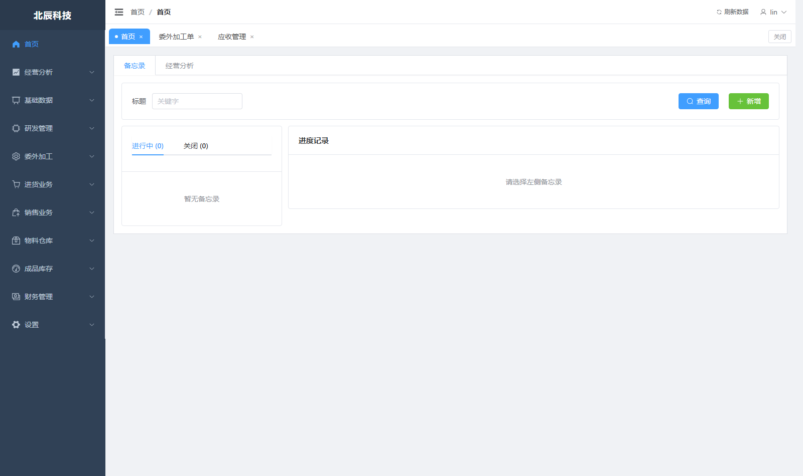

系统共 **11 个功能模块、66 个功能页面**：

| 模块 | 主要用途 | 常见使用者 |
|---|---|---|
| **首页** | 个人工作台：备忘录、经营分析、各模块待办与快捷入口 | 所有人 |
| **经营分析** | 6 张分析报表（经营概览/销售/客户/进货/税务/资金往来），看数不下单 | 管理者、财务 |
| **基础数据** | 品牌、产品、客户、供应商、供货商、物料类型、物料信息、仓库、合同模版 | 管理员 |
| **研发管理** | 研发立项、项目 BOM / 阶段 / BUG / 图纸、研发物料、屏幕资料知识库 | 研发 |
| **委外加工** | 加工订单→收退→结单；物料订单→收退；加工/物料售后（退货、维修） | 跟单 |
| **进货业务** | 成品采购单、采购退货单、采购换货单 | 采购 |
| **销售业务** | 销售单、销售退货单、销售换货单 | 销售 |
| **成品库存 / 物料仓库** | 库存详情与流水、移仓、盘点、其他出入库、报损、规格调整、退货整理 | 仓管 |
| **财务管理** | 应收应付、收付款、账单、费用、账户、资金流水、发票、应付转应收 | 财务 |
| **设置** | 用户、角色、菜单权限、系统信息、数据导入导出、清空数据 | 管理员 |

> **一句话理解各模块的关系**：基础数据是"字典"，研发立项产出"产品与 BOM"，委外加工/进货把货做出来买进来，销售把货卖出去，库存记录每一次移动，财务把每一笔钱算清楚，经营分析把这些数字汇总起来。

## 1.2 登录与退出

### 1.2.1 登录

访问系统地址（请向管理员索取）：`https://<服务器IP或域名>`

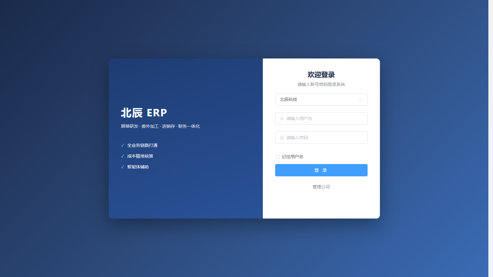

登录需要**三个信息**，缺一不可：

| 字段 | 说明 |
|---|---|
| **公司** | 下拉选择。系统按"公司 + 用户名"定位账号，所以**必须先选对公司在哪个公司下登录**（列表加载后默认选中第一个公司） |
| **用户名** | 如 `lin`、`admin1` 等 |
| **密码** | 长度不少于 3 位；可点眼睛图标查看明文 |

> 「记住用户名」勾选后只记住**用户名**（不含密码），下次打开自动回填。

**常见登录失败提示**：

| 提示 | 含义与处理 |
|---|---|
| 请选择公司 | 没有选公司，先选公司 |
| 用户名或密码错误 | 账号或密码不对（系统刻意不区分"账号不存在"与"密码错误"，防试探） |
| 账号已被禁用 | 该账号被停用，请联系管理员启用 |
| 公司列表加载失败，请刷新页面重试 | 网络或后端异常，刷新页面重试 |

### 1.2.2 超管登录与「管理公司」

平台超级管理员（默认账号 `lin`）负责**跨公司的平台运维**。登录页右下角有「**管理公司**」入口：

1. 点「管理公司」→ 弹窗输入**超级管理员账号 / 密码** → 「验证并进入」；
2. 进入「公司管理」页，可以：**新增公司、启停公司、进入某家公司**、编辑、删除；
3. 点某公司的「进入系统」即可**切换公司上下文**，之后的看数/操作都按该公司隔离；
4. 连续 5 次密码错误会**临时锁定 10 分钟**，提示"失败次数过多，该账号已临时锁定，请 N 秒后重试"。

> ⚠️ 公司管理员（`admin`）只能看到自己公司的数据，看不到「管理公司」入口。

### 1.2.3 退出登录

右上角用户名下拉 →「退出登录」→ 确认「确定要退出登录吗？」→ 回到登录页。

### 1.2.4 安全提示（生产环境务必执行）

1. **首次上线必须修改默认口令**（`lin` 的初始口令为开发默认值，生产应由运维在部署时注入新口令）；
2. 密码交给个人保管，不要共用账号（**操作留痕按账号记**，共用无法追责）；
3. 离开电脑请退出登录或锁屏。

## 1.3 界面导航与通用操作

### 1.3.1 整体布局

```
┌──────────────────────────────────────────────────────────────┐
│ Logo/公司名 │ ☰ │ 首页 / 委外加工 / 加工订单   刷新数据  用户名▾ │  ← 顶栏
├──────────────┬───────────────────────────────────────────────┤
│  侧栏菜单     │ 页签： [加工订单 ×] [销售单 ×] ...              │  ← 多页签
│  首页         ├───────────────────────────────────────────────┤
│  经营分析 ▾   │ 筛选行： [条件…] [查询] [重置]        [+新增]   │
│  基础数据 ▾   ├───────────────────────────────────────────────┤
│  委外加工 ▾   │ 表格（列头可排序、单号/主体可点进详情）         │
│  …            │ 分页： 共 N 条  [每页条数]  1 2 3 …            │
└──────────────┴───────────────────────────────────────────────┘
```

### 1.3.2 侧栏菜单

- 最多**三级**：一级目录（如"委外加工"）→ 二级（如"加工售后"）→ 三级叶子（如"工厂售后"）；
- 点目录可展开/收起；点叶子直接进入页面；侧栏可点 ☰ 折叠成图标条（省屏幕空间）；
- **你能看到哪些菜单由角色决定**（见 1.4）。

### 1.3.3 顶部三件套：位置导航 / 刷新数据 / 用户

| 元素 | 说明 |
|---|---|
| **位置导航** | 顶栏那行"首页 / 一级目录 / 二级目录 / 当前页面"就是它（软件行业叫"面包屑导航"，见附录 A）；点其中任一层可跳回该层；新增/编辑页会额外显示操作名 |
| **刷新数据** | 普通页面=整页刷新；**新增/编辑页=只刷新下拉框数据**（避免丢掉你填了一半的表单） |
| **用户下拉** | 显示当前用户，含「退出登录」 |

### 1.3.4 页签（多标签）

- 打开过的页面会留在顶部页签，**点页签可在多个页面间快速切换**；
- 关页签：点 `×`，或**鼠标中键点页签**；
- 关当前页签后会回到"上一个活跃页签"，都没有则回首页；
- 页签栏可横向滚动（鼠标滚轮/左右箭头）；
- **未保存的修改会被保护**：关闭/切换页签时若页面有未保存内容，会先弹确认。

> 小技巧：同一个页面的不同筛选状态（如"成品库存详情"带不同仓库参数）会**复用同一个页签**，不会越开越多。

### 1.3.5 列表页的统一操作（全站一致）

1. **筛选行**：填写条件 → 点「查询」（多数输入框**按回车也等于查询**）；点「重置」清空条件并重查；
2. **表格**：列头带"排序箭头"的可点击排序；单号、客户、供应商、产品、仓库等**蓝色文字可点进详情**；列宽不足时鼠标悬停可看完整内容；
3. **分页**：可切换每页 10/20/50/100 条；**改每页条数会自动回到第 1 页**；
4. **操作列**固定在表格右侧，常见动作：详情 / 编辑 / 审核 / 反审核 / 作废 / 删除（**按钮是否出现取决于单据状态和你的权限**）。

### 1.3.6 次级页（新增 / 编辑 / 详情）

这类页面统一是"页头 + 内容 + 底部操作"：

- 左上「← 返回」；标题右侧可能有辅助信息；
- 右上或底部是主操作（**「保存」永远在最右边**）；
- 详情页通常**草稿状态可直接改并保存**，已审核状态只读（需先反审核才能改）。

### 1.3.7 统计区间（分析类页面统一）

经营分析各页顶部都有「统计区间」，固定 7 个选项：**昨日 / 今日 / 本周 / 本月 / 本季 / 本年 / 自定义**。

- 选「自定义」才出现起止日期选择框；
- 切换预设会清空已选日期；
- 所有分析页**按"建单日期"归期**（不是按单据上填的业务日期）。

### 1.3.8 可导出 Excel 的页面

以下页面支持「导出 Excel」（导出内容跟随当前筛选条件）：

| 页面 | 导出文件名 |
|---|---|
| 税务分析 | 税务分析_日期.xlsx |
| 屏幕资料 | 屏幕资料_日期.xlsx |
| 成品库存详情 / 产品库存分布详情 | 对应名称 |
| 成品库存流水 / 物料库存流水 | 对应名称 |
| 仓库详情 / 产品库存流水详情 / 物料库存流水详情 | 对应名称 |
| 物料库存详情 / 物料库存分布详情 / 委外仓库详情 | 对应名称 |

> 其他列表页暂不支持直接导出；如需数据快照，可用「设置 → 数据管理」导出整库 JSON（仅超管）。

### 1.3.9 常见提示与错误对照

| 提示 | 原因与处理 |
|---|---|
| 登录已失效，请重新登录 | 会话过期（默认 24 小时）或已在别处退出，重新登录即可 |
| 无权限访问 | 你的角色没有这个页面/接口的权限，联系管理员分配 |
| 请求参数格式不正确：… | 一般出现在手工改地址栏参数时，正常点按钮不会出现 |
| 字段内容过长，请缩短后重试 | 输入超过长度限制 |
| 存在重复数据（编码/单号已被占用） | 单号或编码重复，重试或换一个 |
| 系统异常: … | 后端异常，**请把提示原文截图给管理员/开发** |

## 1.4 角色与权限

### 1.4.1 内置角色

系统预置 7 个角色（可在「设置 → 角色管理」中新建更多）。其中 **超级管理员 / 管理员** 属"内置角色"（不可编辑、不可删除），其余可按需调整或删除：

| 角色编码 | 名称 | 默认能看什么 |
|---|---|---|
| `super_admin` | 超级管理员 | 平台级：整库导入导出、跨公司运维（**不参与日常业务分工**） |
| `admin` | 管理员 | 全部菜单（含设置、经营分析） |
| `dev_engineer` | 研发工程师 | 首页、基础数据、研发管理（立项/研发物料/屏幕资料）、产品、模版 |
| `sales` | 销售专员 | 首页、基础数据、销售业务、产品、客户 |
| `warehouse` | 仓管员 | 首页、基础数据、进货业务、销售单、成品库存、物料仓库 |
| `merchandiser` | 跟单专员 | 首页、基础数据、委外加工、进货/销售、库存、物料仓库（含物料盘点） |
| `finance` | 财务 | 首页、基础数据、财务管理（应收应付/收付/账单/费用/账户等） |

> **经营分析**默认只给管理员；需要给其他人看时，由管理员在「角色管理 → 分配权限」里勾选。

### 1.4.2 两级权限

| 级别 | 控制什么 | 在哪配置 |
|---|---|---|
| **页面权限** | 侧栏能看到哪些菜单、能否直接打开某个页面 | 角色管理 → 分配权限；或用户管理 → 权限（单用户自定义） |
| **按钮权限** | 页面内的"审核 / 反审核 / 作废 / 删除"等按钮是否出现 | 由角色权限自动附带（动作码跟随页面） |

> 权限是**双重校验**：按钮看不见 → 说明没权限；即使绕过界面直接调接口，后端同样会拒绝。

### 1.4.3 页面权限模式（用户级自定义）

在「用户管理 → 操作列『权限』」里，每个用户有两种模式：

| 模式 | 含义 | 适用 |
|---|---|---|
| **跟随角色**（默认） | 能看的页面 = 角色的菜单授权；**角色权限变化时自动跟随** | 绝大多数人 |
| **自定义** | 能看的页面**完全以该用户单独勾选的为准**（可加可减）；角色变化**不会**自动同步 | 特殊岗位（如某销售还要看某个库存页） |

规则与限制：

- 自定义**至少要勾一个页面**，且系统会**强制保留「首页」**并自动补上上级目录；
- **不能修改自己的页面权限**（防止把自己锁在门外）；
- **超级管理员固定跟随角色**，不能自定义；

### 1.4.4 权限变更什么时候生效

权限是**登录时快照**：管理员改了你的角色/权限后，**你需要退出重新登录**才会生效。

## 1.5 通用业务规则（**请先读这一节，后面各章不再重复**）

### 1.5.1 单据状态：草稿 / 已审核 / 已作废

系统里几乎所有单据都是这三态：

| 状态 | 含义 | 一般可做的动作 |
|---|---|---|
| **草稿** | 还没生效，**不动库存、不动账** | 编辑、审核、作废、删除（部分单据） |
| **已审核** | 已生效，库存/账务已落账 | 反审核（回滚）、部分单据可"结案" |
| **已作废** | 作废留痕，不再参与业务 | 只读查看 |

> 关键认知：**「保存」不等于"生效"**。保存只产生草稿，必须点「审核」才会真正动库存和账。

### 1.5.2 审核 / 反审核 / 作废

| 动作 | 作用 | 前置条件 | 副作用 |
|---|---|---|---|
| **审核** | 草稿 → 已审核，**执行库存与账务** | 只有草稿可审核 | 加/减库存、生成应收/应付、回写上游单据数量 |
| **反审核** | 已审核 → 草稿，**等量逆向回滚** | 只有已审核可反审核；账已收付/库存已被下游消耗时会**被拦** | 冲回库存、冲销台账（原记录保留并标注"已作废"留痕） |
| **作废** | 草稿 → 已作废 | 只有草稿可作废（已审核要先反审核） | 无库存账务影响，仅留痕 |

**反审核常见的"被拦住"情形**（都是保护措施，不是故障）：

| 提示 | 含义 | 处理 |
|---|---|---|
| 该…对应的应付/应收账款已核销，无法反审核 | 这笔账已经收/付过款了 | 先反审核对应的收款单/付款单 |
| 该…对应库存已被后续单据消耗，无法反审核 | 货已被卖掉/用掉 | 先处理占用该库存的单据 |
| 已有货物被退货整理，无法反审核 | 退货品已被整理入库 | 先反审核对应的退货整理单 |
| 该退货单已有「加工返回」记录，请先撤销返回 | 售后货已回到我方 | 先在详情页逐条撤销返回 |

### 1.5.3 单号规则（前缀速查）

单号由系统自动生成，格式一般为 **前缀 + 日期 + 流水**，便于一眼识别单据类型：

| 前缀 | 单据 | 前缀 | 单据 |
|---|---|---|---|
| `WO-` | 委外加工单 | `XS-` | 销售单 |
| `MWO-` | 委外物料订单 | `XTH-` | 销售退货单 |
| `DEL-` | 委外交货/收料单 | `HH-` | 销售换货单 |
| `GTH-` | 加工退货（关联加工单） | `CG-` | 成品采购单 |
| `GTW-` | 加工退货（不关联加工单，工厂售后） | `TH-` | 采购退货单 |
| `ORB-` | 加工返回单 | `CH-` | 采购换货单 |
| `OR-` | 加工退货单（客户售后/维修退货） | `YC-` | 成品移仓单 |
| `MRH-` / `MRW-` | 物料退货（关联/不关联订单） | `MYC-` | 物料移仓单 |
| `OWO-` | 物料其他出入库（委外仓） | `TS-` | 退货整理单 |
| `WBS-` | 委外物料报损 | `PD-` | 库存盘点单 |
| `DEV-` | 研发项目 | `BS-` | 成品报损 |
| `SKU-` / `NS-` | 产品编码（按供货商前缀） | `SK-` / `FK-` | 收款单 / 付款单 |
| `YF-` | 应付台账号 | `FL-` | 资金流水号 |
| `ZD-` | 财务账单号 | `FY-` | 费用单号 |
| `PZ-` | 应付转应收单 | `CU-` | 客户编码 |
| `PC-` | 规格调整（改品质） | `QT-` | 成品其他出入库 |
| `MR-` | 物料退货（存量旧单号，新单已改 MRH-/MRW-） | `DEF-` | 委外退不良（存量旧单号） |

### 1.5.4 数量与金额的精度（重要）

| 项目 | 规则 |
|---|---|
| **数量** | **一律整数**（系统不接受小数，填小数会被自动取整并在后台记录告警） |
| **单价** | 4 位小数（部分单据页面显示 2 位） |
| **金额** | 2 位小数，四舍五入；金额 = 数量 × 单价 |
| **税率/税额** | 税额 = 价税合计 × 税率 ÷ (100 + 税率) |

### 1.5.5 品质等级（成品）

成品库存按**品质**分账，同一仓库同一产品可以并存 5 档：

| 值 | 页面文案 | 含义 |
|---|---|---|
| `A` | A规 | 优等品 |
| `B` | B规 | 合格品 |
| `C` | C规 | 次品 |
| `DEFECT` | 不良品 | 缺陷品 |
| `PENDING` | **待整理** | **售后退回品的暂存档**，需经「退货整理」分选成 A/B/C/不良 |

要点：

- **销售出货只能出 A/B/C 良品**（不良品/待整理不可销售）；
- 客户退回的货默认进「待整理」，由仓管用「退货整理」单分选；
- 物料库存**不分品质**（只有"良品/不良"的展示位，实际按仓库+物料记账）。

### 1.5.6 库存形态（理解委外售后的关键）

委外仓（加工厂/供应商处的仓）里可能同时存在**四种形态**的货，它们**互不混算**：

| 值 | 页面文案 | 谁的责任 | 出现场景 |
|---|---|---|---|
| `MATERIAL` | 物料（常规） | — | 发到工厂的**料**（主账） |
| `PRODUCT_DEFECT` | 成品（加工退货） | **工厂责任** | 退回工厂的成品（等修好送回，赔料） |
| `PRODUCT_REPAIR` | 成品（维修退货） | **我方责任** | 客户售后品送厂维修 |
| `MATERIAL_REPAIR` | 物料（送修在厂） | **我方责任** | 物料送供应商维修 |

> 所以看到"同一仓库同一物料有两行库存"是正常的——一行是常规物料，一行是"送修在厂"。

### 1.5.7 仓库类型

| 业务叫法 | 系统归类 | 管理页面 |
|---|---|---|
| **成品仓** | 自有仓 + 成品仓 | 基础数据 → 成品仓库管理 |
| **辅料仓（自有物料仓）** | 自有仓 + 辅料仓 | 基础数据 → 自有物料仓管理 |
| **委外仓** | 委外仓（绑定一个加工厂/供应商） | 基础数据 → 委外仓库管理 |

- 新增**任何**往来单位（加工厂/供货商/辅料商/方案商）时，系统会**自动为该单位创建一个委外仓**（命名"{单位名}委外仓库"）；
- 仓库可以**停用**（停用后不能再被选作出入库仓），历史数据仍保留。

## 1.6 上手三步走

如果你是新用户，建议按这个顺序练手：

1. **看数据**：先进「成品库存详情」「应收管理」等**只读页**熟悉界面与数据；
2. **走一单**：按 [第 11 章 典型业务场景走查](#第-11-章-典型业务场景走查) 里的一条主线（如"销售到收款"）完整走一遍；
3. **再碰危险操作**：反审核、作废、清空数据这类动作，先读完本章 1.5 与对应章节再操作。

---

# 第 2 章 基础数据

> **本章是"字典"**：所有单据都要用到这里维护的数据。**新系统上手第一步就是把本章的数据建起来**，否则开单时会发现"下拉里没有东西可选"。

基础数据共 11 个页面，分四组：

| 分组 | 页面 |
|---|---|
| 商品与客户 | 品牌管理、产品管理、客户管理 |
| 往来单位 | 供应商管理、供货商管理 |
| 物料 | 物料类型管理、物料信息管理 |
| 仓库与模版 | 成品仓库管理、委外仓库管理、自有物料仓管理、模版管理 |

## 2.1 品牌管理

**路径**：基础数据 → 品牌管理　**用途**：维护产品品牌，供「产品管理」和「研发立项」挂靠。

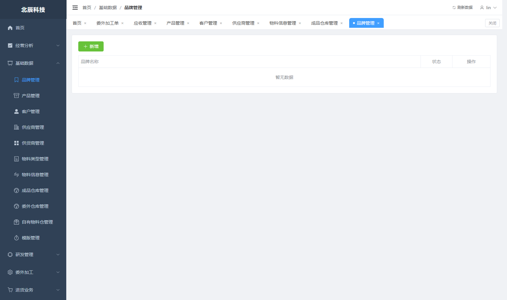

| 操作 | 说明 |
|---|---|
| 新增 | 填**品牌名称**（必填，不可重名）→ 保存 |
| 编辑 | 改名称或状态 |
| 删除 | **被产品/研发立项引用时不能删除**，提示"该品牌有关联数据，无法删除：物料 N 条 / 研发立项 M 条" |

**状态**：设为"禁用"后，新增产品/新立项时**选不到**该品牌（历史数据不受影响）。

## 2.2 产品管理（核心）

**路径**：基础数据 → 产品管理　**用途**：维护**成品**主数据——销售、采购、库存、委外加工单里的"产品"都来自这里。

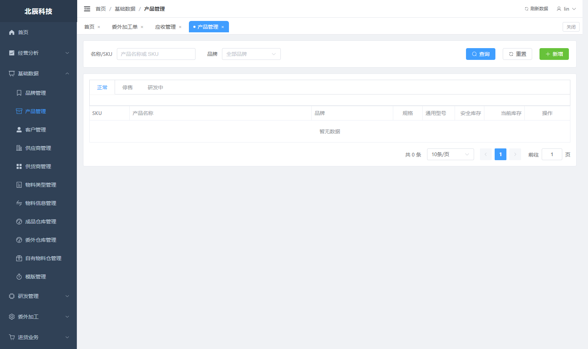

### 2.2.1 列表页

- **页签**：正常 / **停售** / **研发中**（默认只显示"正常"，停售的产品要去"停售"页签找）；
- **筛选**：名称或 SKU（关键字）、品牌；
- **预警**：设置了安全库存的产品，当前库存低于安全库存时**整行标红 + "预警"标签**；
- 列：SKU、产品名称、品牌、规格、通用型号、安全库存、当前库存。

### 2.2.2 新增 / 编辑字段

| 字段 | 必填 | 说明 |
|---|---|---|
| SKU | 否（留空自动生成） | 进页面会**自动预填**下一个可用编码；也可手工填（公司内不可重复）；**编辑时改 SKU 会二次确认**——提示"历史单据中的 SKU 是当时的快照，不会一并更新" |
| **产品名称** | **是** | 改名会**同步到关联的研发项目** |
| 供货商 | 否 | 只列"供货商（成品商）"；**新增时**选它会按该供货商的"供货SKU"前缀重算 SKU（如 `ABC-000001`）；**编辑时改它不会改已有 SKU** |
| 品牌 | 否 | 取"启用"的品牌，可点「+ 新增」直接去建 |
| **规格** | **是** | 三选一：**原装 / 原配 / 改配**（研发立项建的产品的规格来自项目） |
| 通用型号 | 否 | 适用于多款机型的通用标识 |
| 单位 | 否 | 默认 `pcs` |
| 状态 | 是 | 正常 / 停售 / 研发中 |
| 安全库存 | 否 | 整数；低于它会在列表预警 |
| 成本价 | 否 | **移动加权平均**（入库自动更新）；**手工填过就会被"锁定"**，之后自动加权跳过（下方灰字显示"最近进价"） |
| 备注 | 否 | — |

**编辑页附加信息**：SKU 库存分布表（按仓库列出 A/B/C/不良/待整理各档数量，点击可看该产品的库存流水）。

### 2.2.3 SKU 生成规则（理解编码从哪来）

```
SKU 形态：{前缀}-{6 位流水}
前缀来源：① 供货商配了"供货SKU" → 用它的值（如 ABC → ABC-000001）
          ② 没选供货商/没配前缀 → 默认 SKU-（SKU-000001）
          ③ 研发立项自动建产品 → NS-（NS-000001）
各前缀的流水号互相独立（ABC-000001 与 SKU-000001 可以并存）
```

### 2.2.4 删除 = 停用

- 点「删除」实际是**停用**：产品进"停售"页签，历史单据保留；
- 前端提示："确定要停用物料「X」吗？停用后仍可在'停售'标签页查看"。

> ⚠️ **产品 vs 物料**别搞混：**产品**是"成品"（有 SKU、有安全库存、参与销售/采购/成品库存）；**物料**是"料"（无 SKU、有子物料组成、参与委外加工）。见 2.7。

## 2.3 客户管理

**路径**：基础数据 → 客户管理　**用途**：销售业务与应收账款的往来主体。

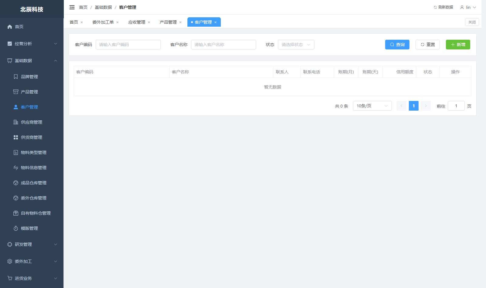

| 字段 | 说明 |
|---|---|
| 客户编码 | **只读**，保存时系统生成 `CU-日期-序号` |
| **客户名称** | **必填** |
| 联系人 / 联系电话 / 地址 / 备注 | 选填 |
| **账期（月）** | 0–24，决定"应收到期日"（应收到期 = 销售单日期 + 账期月 + 账期天） |
| **账期（天）** | 0–31，与月叠加 |
| 信用额度 | ≥0，供业务参考 |
| 状态 | 合作中 / 已停用 |

**要点**：

- 页面**没有删除**，只有"停用/启用"；**停用后销售单的客户下拉里不再出现**；
- 详情页下方带该客户的**销售记录**，可点进销售单。

## 2.4 / 2.5 供应商管理与供货商管理

这两个菜单是**同一套界面**的两种模式，区别只在"类型"：

| 菜单 | 管的是 | 类型 |
|---|---|---|
| **供应商管理** | 加工厂 / 辅料商 / 方案商 | 不含"供货商" |
| **供货商管理** | 成品供货商 | 只有"供货商" |

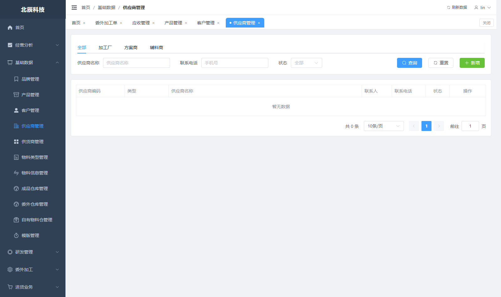

### 2.4.1 四种往来单位类型（很重要）

| 类型 | 页面显示 | 业务里用它做什么 |
|---|---|---|
| **加工厂** `factory` | 加工厂 | 委外加工单的工厂、加工收退、工厂售后、物料订单、委外仓归属、研发立项的"打样/委外工厂" |
| **供货商** `product` | 供货商 | 成品采购单/退货/换货的对方；**产品 SKU 前缀来源** |
| **辅料商** `material` | 辅料商 | 物料信息里的"供应物料"、物料退货退款/工厂维修的对方 |
| **方案商** `solution` | 方案商 | 研发立项的"显示方案 / 触摸方案" |

> 一个单位可以**同时勾选多个类型**（例如既是加工厂又是辅料商）；编码前缀取**勾选的第一个类型**（`FAC-` / `PRO-` / `MAT-` / `SOL-`）。

### 2.4.2 新增字段

| 字段 | 必填 | 说明 |
|---|---|---|
| **类型** | **是** | 至少勾一个 |
| 编码 | 只读 | 系统按首个类型生成 |
| **名称** | **是** | 允许与其他单位重名（会弹窗二次确认"同名将创建为各自独立的往来单位"） |
| **供货SKU** | 仅供货商 | 1–24 位字母/数字/短横线，保存自动**转大写**，公司内唯一；**它就是产品 SKU 的前缀**（如填 `ABC`，新产品 SKU 形如 `ABC-000001`）；被别的供货商占用会报错 |
| 联系人 / 电话 / 地址 / 备注 | 否 | — |
| 账期（月/天） | 否 | 收货/交货后多少天付款，默认当天 |

### 2.4.3 自动创建委外仓（隐藏规则）

**新增任何往来单位时，系统会自动为它创建一个委外仓**（命名为"{单位名}委外仓库"）。

> 这就是为什么"委外仓库管理"里一开始就有仓库。也可以手工再补建/改名。

### 2.4.4 详情页的 6 个页签

基础信息（可编辑）、供应产品（供货商专属）、供应物料（辅料商专属）、**仓库详细**（加工厂专属）、订单列表、**物料缺料**（加工厂专属）。

### 2.4.5 删除 = 停用（有引用校验）

点「删除」前系统会检查该单位是否被引用（产品、加工单、物料订单、采购单、采购退货、应付台账、委外仓有库存），有引用会拦下。

> **停用后**：新单据的下拉里一般不再出现（个别页面刻意不过滤，仍可能选到历史单位）；历史单据与台账不受影响。

## 2.6 物料类型管理

**路径**：基础数据 → 物料类型管理　**用途**：材料分类字典（玻璃、驱动IC、触摸IC、码片IC、排线、盖板、背贴、钢板、COP 等）。

- 页面顶部提示"**类型数据被 BOM 物料清单共用**"；
- 字段：类型名称（必填、公司内唯一）、排序、状态；
- **默认类型不可删除**；类型下还有物料时也删不掉（"该类型下还有 N 个物料，请先处理后再删除"）；
- 禁用后：新增物料、研发立项的改配料下拉里选不到；

> ⚠️ **请勿随意改名**：研发立项的"改配联动"是按类型名（驱动IC/触摸IC/码片IC/排线）匹配的，改名会导致改配 BOM 自动带料**静默失效**。

## 2.7 物料信息管理

**路径**：基础数据 → 物料信息管理　**用途**：维护**物料**（料）主数据——委外物料订单、物料收退、BOM 选料的对象。

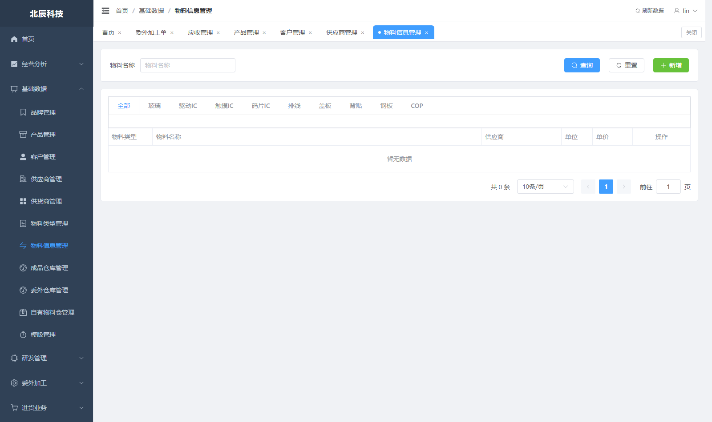

### 2.7.1 列表

- **页签**：全部 + 每个启用的物料类型一个页签（可快速按类型筛）；
- 列：物料类型、物料名称（点进库存分布）、供应商（可多个）、单位、单价；
- 筛选：物料名称。

### 2.7.2 新增 / 编辑字段

| 字段 | 必填 | 说明 |
|---|---|---|
| **物料类型** | **是** | 取启用的类型 |
| **物料名称** | **是** | — |
| 供应商 | 否 | 可多选（一个物料可以有多家供应商） |
| 单位 | 否 | 默认 PCS |
| 单价 | 否 | 参考价，作为单据的默认单价 |
| 备注 | 否 | — |

**子物料组成**（同一表单下半部）：

| 字段 | 说明 |
|---|---|
| 子物料 | 选其他物料（不能选自己） |
| 用量 | 整数，多少个 |
| 损耗率 % | — |

> **子物料的用处**：委外收货时会按子物料**自动扣料**；采购合同导出时会展开成组件行；研发立项的"触摸IC/码片IC"就是挂在"排线"下的子物料。保存是**全量替换**（增删改一次性覆盖）。

### 2.7.3 删除约束（严格）

以下任一情况都不能删除，并给出具体条数：仓库有库存、被物料订单明细引用、被退货单明细引用、被收发单明细引用、**被别处当作子物料引用**。

## 2.8 成品仓库管理

**路径**：基础数据 → 成品仓库管理　**用途**：维护**自有成品仓**（销售出库、采购入库、成品库存、盘点、移仓都用它）。

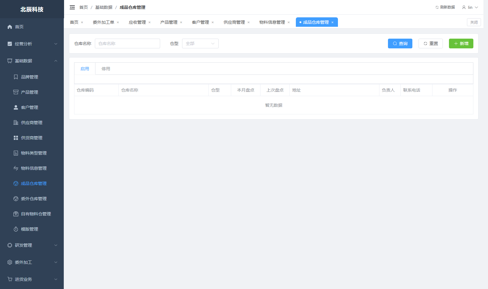

| 字段 | 说明 |
|---|---|
| 仓库编码 | 只读，系统生成 `WH-日期-序号` |
| **仓库名称** | **必填** |
| **仓型** | 本页固定"**成品仓**"（辅料仓请在"自有物料仓管理"维护） |
| 地址 / 负责人 / 联系电话 / 备注 | 选填 |
| 本月盘点 | 列表会显示"已盘点 / 待盘点 / 超期 N 天"——提醒你盘点工作 |

**要点**：

- 页面只有"停用/启用"（**没有删除**）；停用后不能再被选作出入库仓；
- **不良品/售后品不再单独建仓**：统一入成品仓，用"品质"区分（A/B/C/不良/待整理）。

## 2.9 委外仓库管理

**路径**：基础数据 → 委外仓库管理　**用途**：维护**加工厂/供应商处的仓**（委外仓），一仓绑定一个往来单位。

- 字段：**所属供应商（必填）**、**仓库名称（必填）**、地址、联系人、电话、备注；
- 新增往来单位时系统已自动建仓（命名"{单位名}委外仓库"），本页用于补建或改名；
- 页面只有"停用/启用"。

## 2.10 自有物料仓管理

**路径**：基础数据 → 自有物料仓管理　**用途**：维护**辅料仓**（存放委外/采购物料的自有仓）。

- 字段：**仓库名称（必填）**、仓型（固定"辅料仓"）、地址、负责人、电话、备注；
- 物料移仓、物料收退/退货/报损/其他出入库、物料盘点都在这些仓上进行。

## 2.11 模版管理

**路径**：基础数据 → 模版管理（页内两个页签）

### 2.11.1 页签 1：阶段模板管理

**用途**：定义研发立项的**阶段流程**（如"打样 → 小批量 → 结项"）。

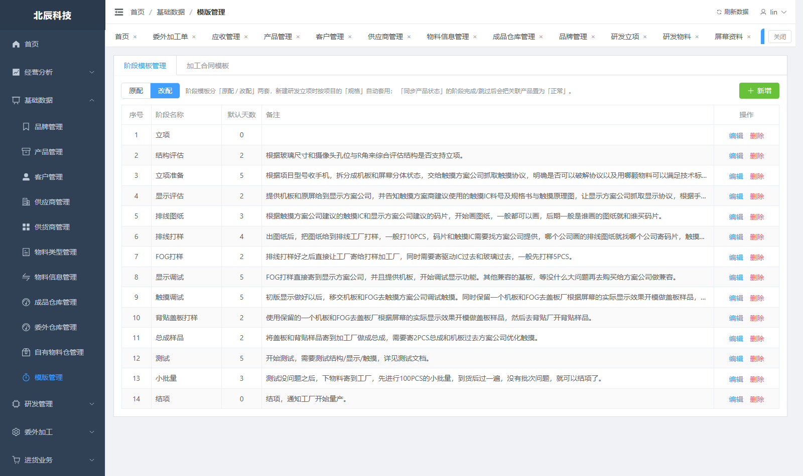

| 字段 | 说明 |
|---|---|
| 阶段名称 | 必填 |
| **适用规格** | 必填：**原配 / 改配**（两套模板互相独立） |
| 默认天数 | 生成项目阶段时的计划天数 |
| 排序 | 决定阶段顺序 |
| 备注 | — |

要点：

- 新建研发立项时，系统按项目的"规格"**自动套用**对应模板生成阶段；
- ⚠️ **该规格下没有阶段模板时，立项会失败**（提示"未找到「原配」的阶段模板，无法初始化项目阶段；请先在…配置"）；
- **「同步产品状态」**：模板中**「小批量」「结项」两个阶段默认开启**该项 —— 这两阶段被"完成/跳过"后，关联产品会从「研发中」**自动变成「正常」**（即可以正式销售）；界面顶部有该机制的文字说明，但**未提供编辑这一项的开关**（取值由模板数据决定）。

### 2.11.2 页签 2：加工合同模板

**用途**：维护导出加工/采购合同时的**条款正文**。

- 页内二级页签：**加工合同 / 采购合同**；
- 字段：模板名称（必填）、状态、**合同条款（富文本，必填）**；
- 每种类型可设一份"**使用中**"模板（点"设为默认"切换）；
- 页面提示：**标题、甲乙双方信息、明细表格、签名区由系统自动生成**，这里只需维护条款文字；
- 使用位置：加工单详情/列表的「下载合同」、物料订单的「下载合同」；
- ⚠️ 删除"使用中"的模板会导致导出报"未找到合同模板"。

---

**本章检查清单**（开单前请确认）：

- [ ] 品牌、物料类型已建好
- [ ] 产品已建（至少 SKU/名称/规格），需要预警的填了安全库存
- [ ] 客户已建（账期正确）、供应商/供货商的**类型**勾对、供货商配了"供货SKU"
- [ ] 仓库齐备：成品仓、辅料仓；加工厂/供应商的委外仓已自动生成
- [ ] 阶段模板（原配/改配各一套）、合同模板已准备

---

# 第 3 章 研发管理

> 研发线是"产品与 BOM 的源头"：**立项 → 自动建产品 → 套用阶段 → 维护 BOM → 下加工单时生成 BOM 快照**。委外加工单能用哪些料，取决于这里的 BOM。

## 3.1 研发立项（核心）

**路径**：研发管理 → 研发立项

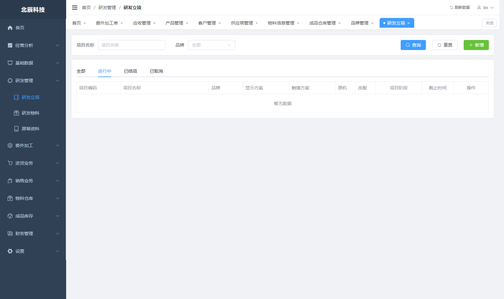

### 3.1.1 列表

- **页签**：全部 / 进行中 / 已结项 / **已取消**（已取消的可以"重新激活"）；
- 列：项目编码（`DEV-`）、项目名称、品牌、显示方案、触摸方案、原机、改配、**当前阶段**、截止时间（超期红色标粗）；
- 操作：详情 / 取消立项；
- 筛选：项目名称、品牌。

### 3.1.2 新增立项（字段分组）

**① 基础信息**

| 字段 | 必填 | 说明 |
|---|---|---|
| **项目名称** | **是** | 若留空又填了产品名称，会自动取产品名 |
| **产品SKU** | **是** | 进页面自动预填 `NS-` 开头的下一个编码；若选择"关联已有产品"则该字段清空并置灰 |
| **产品名称** | **是** | 提交时会**查重**：若已存在同名产品，会弹窗让你二选一：**关联该产品**（不新建）/ **修改产品名称**（中止） |
| **规格** | **是** | 只有 **原配 / 改配** 两种 |
| 适配机型 / 品牌 | 否 | — |
| 显示方案 / 触摸方案 | 否 | 下拉取"方案商"类型单位，也可自行输入；**规格=原配时整块隐藏** |
| 打样工厂 / 委外工厂 | 否 | 下拉取"加工厂"类型单位 |
| 立项日期 / 预计完成 / 备注 | 否 | 立项日期默认当天 |

**② 原机配置（4 项全必填）**：原机尺寸、原分辨率、驱动IC、触摸IC（后两项为手工文本）。

**③ 改配信息（5 项全必填，规格=原配时整块隐藏）**：玻璃尺寸、玻璃分辨率、驱动IC、触摸IC、码片IC（后三项从**物料**下拉选，按类型名"驱动IC/触摸IC/码片IC"过滤）。

### 3.1.3 点「保存」后系统自动做三件事（重要）

1. **按规格套用阶段模板**，生成项目阶段（第一个阶段=进行中）；
   - 若该规格没有阶段模板 → **立项直接失败**（提示去「模版管理 → 阶段模板管理」配置）；
2. **自动创建产品**（状态=研发中、规格取项目规格、SKU 取立项页填的值），并回写项目；
   - 若你在查重弹窗选了"关联该产品"，则**不新建**，只建立关联；
3. **把改配 IC 写进 BOM**：驱动IC = 独立 BOM 行；**触摸IC / 码片IC 挂在"排线"物料的子物料上**（排线物料不存在时会自动创建）。

### 3.1.4 详情页的 6 个页签

| 页签 | 你在这里做什么 |
|---|---|
| **项目信息** | 查看/修改立项信息（改规格会提示"已有阶段不重算，仅之后新建的项目按新规格套用"） |
| **项目阶段** | 阶段流转：**完成 / 跳过 / 撤销 / 一键完成全部**；撤销会提示"后续阶段将全部重置为未开始"；**「小批量」「结项」完成或跳过后，关联产品会自动置为「正常」**（可销售，机制见 2.11.1） |
| **BUG 列表** | 记录研发缺陷 |
| **BOM信息** | 维护物料清单（父物料 + 子物料缩进展示）；可「新建版本」「历史快照」 |
| **图纸文档** | 上传图纸与资料 |
| **项目物料** | 该项目下登记的研发物料（见 3.2） |

### 3.1.5 BOM 的版本与快照（理解委外用料的关键）

**BOM 版本化**：

- 初始为 V1；保存是"**全量替换最新版本**"；
- 点「新建版本」= 复制当前最新版为 V+1，之后改的是新版本；
- **历史版本不可改**（提示"历史版本（Vn）的 BOM 行不可修改，请先新建版本"）；
- **版本的最后一行不可删**（"该行是版本 Vn 的唯一明细，不可删除；如需变更请先新建版本"）。

**BOM 快照（下加工单时才产生）**：

- 快照的键是**产品**（不是加工单）：同一产品**多张加工单共享**同一份快照；
- 系统会比较"研发 BOM 版本 + 明细内容"是否和上一份一致：**一致就复用，不一致才新建**；
- 快照来源 `kind`：`BOM`（与研发 BOM 一致） / `ORDER`（下单时明细有调整或无项目） / `MIGRATED`（历史迁移）；
- 查看入口：立项详情「BOM信息 → 历史快照」（只读，能看到版本、来源、生成时间、被哪些加工单引用）。

> **为什么要快照**：加工单审核、加工退货还料都要按"下单那一刻的用料"算，研发后续改了 BOM 不能影响已下的单。

### 3.1.6 常见错误

| 提示 | 处理 |
|---|---|
| 未找到「原配」的阶段模板，无法初始化项目阶段 | 先去「模版管理 → 阶段模板管理」为该规格建阶段 |
| 请选择规格（原配/改配） | 规格必填 |
| 请填写原机配置-原机尺寸（同类还有若干） | 原机配置/改配信息是整组必填 |
| 项目创建失败: … | 把原文给管理员 |

## 3.2 研发物料

**路径**：研发管理 → 研发物料　**用途**：登记**研发自购用料**（机板、原屏幕、测试架、资料盒等），与 BOM / 委外物料无关，是独立台账。

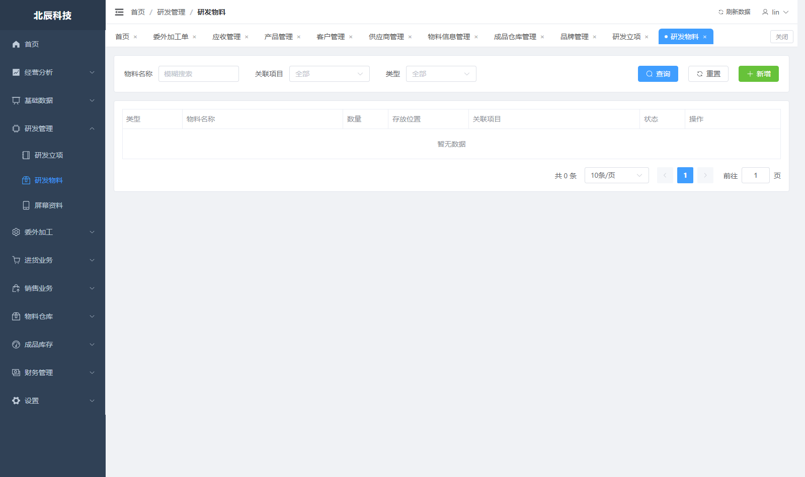

### 3.2.1 列表与筛选

- 列：类型、物料名称（点进详情）、数量、存放位置（取最新一条流转记录）、关联项目、状态；
- 筛选：物料名称、关联项目（可选"未关联项目"）、类型；
- 操作：详情 / **研发支出** / 删除。

### 3.2.2 新增字段

| 字段 | 说明 |
|---|---|
| **物料名称** | 必填 |
| 类型 | 基板 / 屏幕 / 测试架 / 触摸资料盒 / 显示资料盒 / 其他 |
| 关联项目 | 可空（不关联立项） |
| 数量 | ≥0 整数 |
| 金额 | ≥0 |
| 状态 | 完好 / 已损坏 / 已使用 |
| 采购日期 | 默认当天 |
| 位置详情 | 具体库位/货架号 |
| 备注 | — |

### 3.2.3 研发支出（新增时勾选）

勾选"研发支出"后展开：**支出金额（必填，>0）**、**支出账户（必填）**、费用日期、费用备注。

保存后的行为：

1. 先建研发物料，再**自动生成一张「研发支出」费用单**（费用类型=RND 研发支出）；
2. **我（当前操作人）有费用审核权限时**：费用单**自动审核、当场从账户扣款**；
3. **我没有费用审核权限时**：费用单**降级为草稿**（不越权动钱），需要财务去「费用管理」审核；
4. 同一个物料重复登记支出 → 系统返回**原来那张单**（不会重复扣款）；
5. 账户余额不足 → **整体失败回滚**（不会留下半个物料）。

> 在「研发物料」列表行上有「研发支出」按钮，可对已有物料补登记。

### 3.2.4 位置流转记录（详情页）

- 每次新增/编辑/删除都会留痕，字段：位置类型（自有仓库 / 委外仓库 / 供应商 / 客户 / 自定义文本）、位置、经办人、流转时间、图片、备注；
- 选"自有仓库/委外仓库/供应商/客户"时**必须选具体位置**；
- 列表的"存放位置"取**最新一条**流转记录。

## 3.3 屏幕资料（知识库）

**路径**：研发管理 → 屏幕资料　**用途**：行业机型屏幕参数**知识库**（折叠屏 / 直板 AMOLED），供研发评估机型时查阅。

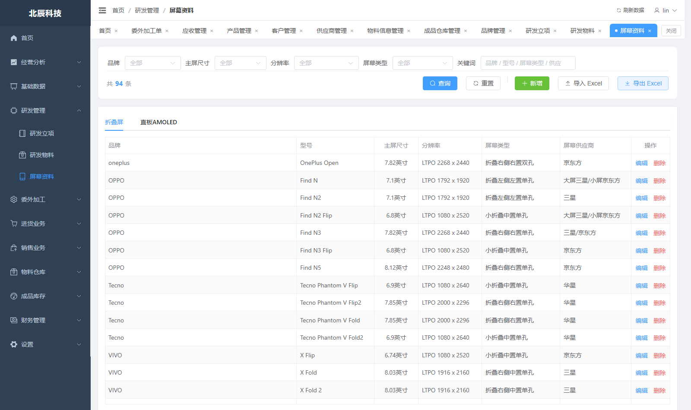

| 项 | 说明 |
|---|---|
| 页签 | 折叠屏 / 直板AMOLED |
| 筛选 | 品牌、主屏尺寸、分辨率、屏幕类型、关键词 |
| 新增 | **品牌 + 型号必填**（同品牌同型号不可重复）；其余字段（尺寸/分辨率/刷新率/指纹/副屏参数/供应商/发布时间）选填，可下拉也可自由输入 |
| **导入** | 支持 Excel 批量导入：表头中文（类别/品牌/型号/主屏尺寸/分辨率/…）；**单次上限 1000 条**；缺品牌或型号的行会被跳过；重复项自动跳过 |
| **导出** | 按当前筛选导出 Excel（15 列） |

**两点要知道**：

- 这些资料是**行业共享知识库**（不分公司，所有公司看同一份）；
- 系统首次启动会自动导入一份种子数据；**"清空数据"不会清空它**。

---

# 第 4 章 委外加工

> **本章是系统的核心**（也是流程最复杂的一章）。屏幕行业的典型形态是"我方出料、工厂加工"，所以这里要分清**两条主线**：**成品/加工单线**（WO-）与**物料/物料单线**（MWO-），它们的骨架相似，但细节不同。

## 4.1 先搞清 5 个概念

### 4.1.1 两条主线

| | **成品线（加工单）** | **物料线（物料订单）** |
|---|---|---|
| 对象 | 成品（一单可多个产品） | 物料（一单多个物料） |
| 单据 | 加工订单 `WO-` | 物料订单 `MWO-` |
| 收退 | 加工收退（收货/退货） | 物料收退（收料/退不良/退货） |
| 售后 | 工厂售后 `GTW-` / 客户售后 `OR-` | 工厂维修 `MRW-` / 退货退款 `MRH-` |
| 收货要拆规格吗 | **要**（A规/B规/C规/不良四档） | 不用（按物料行） |
| 结单 | **结单报表**（算损耗、自动退料、超损赔款） | 纯状态变更（不校验收满） |

### 4.1.2 供料模式

加工单表头有「供料模式」：

| 模式 | 含义 | 影响 |
|---|---|---|
| **来料加工**（我方供料） | 料由我方出 | 所有物料的"供料方"锁定为"我方供" |
| **包工包料**（工厂包料） | 料由工厂出 | 供料方按 BOM 行设置，工厂供的料不扣我方委外仓 |

### 4.1.3 委外仓的四种形态（复习 1.5.6）

| 形态 | 谁的责任 | 由什么业务写入 |
|---|---|---|
| 物料（常规） | — | 发料、收料、结单退料、加工领料扣减、退货还料 |
| 成品（加工退货） | **工厂责任** | 工厂售后（GTW-）送厂 |
| 成品（维修退货） | **我方责任** | 客户售后（OR-）送修 |
| 物料（送修在厂） | **我方责任** | 物料工厂维修（MRW-）送修 |

### 4.1.4 数量口径（会算错的地方）

| 口径 | 含义 |
|---|---|
| **已收** | 累计已审核收货数量 |
| **净已收** | 已收 − 已退货（红冲会自动冲减"已收"） |
| **可退** | 已收 − 已退不良 − 送修中 − 订单退料 − 其他已审核退货退款 |
| **需求数量** | 加工数量 × 单套用量（四舍五入取整） |

### 4.1.5 委外触发哪些账务

| 业务动作 | 账务结果 |
|---|---|
| 加工收货审核 | **正向应付**（收货数量 × 加工单价），挂加工厂 |
| 加工退货（红冲）审核 | **负向应付**（冲减加工厂欠款） |
| 结单超损 | **负向应付**（超损赔偿） |
| 工厂售后 + 登记返回审核 | 按实际用料生成**对加工厂的应收**（赔料） |
| 客户售后（维修）返回审核 | **正向应付**（维修费，工厂向我方收取） |
| 物料收料审核 | **正向应付**（挂供应商） |
| 物料退不良（折现退款）/ 物料退货 | **负向应付** |
| 物料退货退款（REFUND） | **对供应商的应收**（供应商退钱给我们） |
| 物料工厂维修 | 有维修费时 **正向应付** |

> 所有这些台账都能在「财务管理 → 应付管理 / 应收管理」里按"业务场景"看到，并点回原单据。

## 4.2 加工订单（WO-）

**路径**：委外加工 → 加工订单　**用途**：向加工厂下加工单，约定产品、数量、加工单价、供料模式与 BOM 用料，是后续收货/退货/结单的依据。

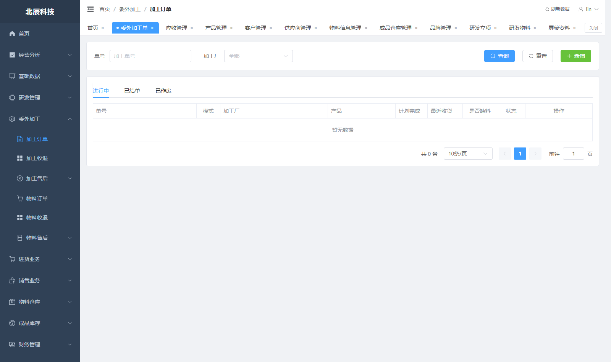

### 4.2.1 列表

- **页签**：进行中（待审核 + 生产中） / 已结单 / 已作废；
- 列：单号、模式（包料/来料）、加工厂、产品、计划完成、最近收货、**是否缺料**、状态；
- 操作：详情、下载合同、作废；
- 筛选：单号、加工厂。

**「是否缺料」列**：仅"进行中"计算，口径 = 剩余待收量所需物料 > 该工厂委外仓的良品库存。缺料时可一键「去采购 / 去委外」跳物料订单新增并带参预填。

### 4.2.2 新增加工单

**表头**：

| 字段 | 必填 | 说明 |
|---|---|---|
| **加工厂** | **是** | 必须是"加工厂"类型的单位（选错类型会被后端拒绝） |
| 供料模式 | — | 来料加工 / 包工包料；**切换会重算所有物料的"供料方"** |
| 计划开始 / 计划完成 | — | 计划完成过期且未结单时列表标红 |
| 是否含税 / 税率 | — | 开启含税默认 13% |
| 备注 / 合同文件 | — | 合同支持拖拽上传 |

**产品行（可多行）**：

| 字段 | 必填 | 说明 |
|---|---|---|
| **加工产品** | **是** | 选"研发项目"（选中后**自动按 BOM 拉出物料清单**） |
| **数量** | **是** | **整数**；改数量会重算每行物料需求 |
| 加工单价 / 包工包料单价 | — | 标签随供料模式变化 |
| 小计 | 自动 | 数量 × 单价 |

**BOM 物料行**（自动带出）：

- 只读列：类型、物料名称、单位、单价、单套用量、需求数量；
- 可编辑列：**损耗率 %**、**供料方**（我方供 / 工厂包；来料模式下锁定为"我方供"）、备注；
- **需求数量 = 加工数量 × 单套用量**（取整）。

### 4.2.3 状态与动作

| 状态 | 页面文案 | 可以做什么 |
|---|---|---|
| `PENDING` | 待审核 | 编辑、**审核**、作废 |
| `PRODUCING` | 生产中 | **反审核**、去"加工收退"收货/退货、去"结单报表"结单、作废 |
| `FINISHED` | 已结单 | 只读；可在结单报表里"反结单" |
| `CANCELLED` | 已作废 | 只读 |

**关键规则**：

- **只有待审核的加工单可以编辑**（提示"只有待审核的加工单可以编辑（当前状态：xxx）；已审核的请先反审核"）；
- **审核**：待审核 → 生产中，记录实际开始日期与审核人；**加工单审核本身不动库存、不动账**（真正的库存与账务发生在收货审核）；
- **反审核**：生产中 → 待审核，并且**会级联反审核该单下所有已审核的收货记录**（逐条逆回库存/应付）；
- **作废**：存在**已审核收货单**时被拒绝（"加工单存在已审核收货单，请先反审核后再取消"）；草稿态的收货单会被一并删除。

### 4.2.4 结单与结单报表

结单不是简单改状态——它会**结算损耗并自动退料**：

1. 进入「加工收退 → 该单 → 结单报表」，系统统计：留存量、损耗、良率；
2. 工厂处**剩余物料自动退回**我方（生成调拨单）；
3. 加工厂**遗失/超损**部分生成**出库单 + 负向应付**（工厂赔款）；
4. 结单后该单**不能再收货**；
5. 「反结单」会把上述退料/出库/超损应付**全部冲回**，回到生产中。

### 4.2.5 常见错误

| 提示 | 处理 |
|---|---|
| 加工厂不存在 / 不是加工厂类型，请选择加工厂 | 去"供应商管理"把该单位勾上"加工厂"类型 |
| 至少需要一个加工产品 / 加工产品数量必须大于0 | 补产品行 |
| 工厂无委外仓库，请先在【委外仓库】页面为该工厂创建委外仓库 | 新增该加工厂时应已自动建仓，若被删需补建 |

## 4.3 加工收退（收货 / 退货）

**路径**：委外加工 → 加工收退　**用途**：按加工单登记**成品收货**（分 A/B/C 规与不良），并对已收成品发起**加工退货（红冲）**。

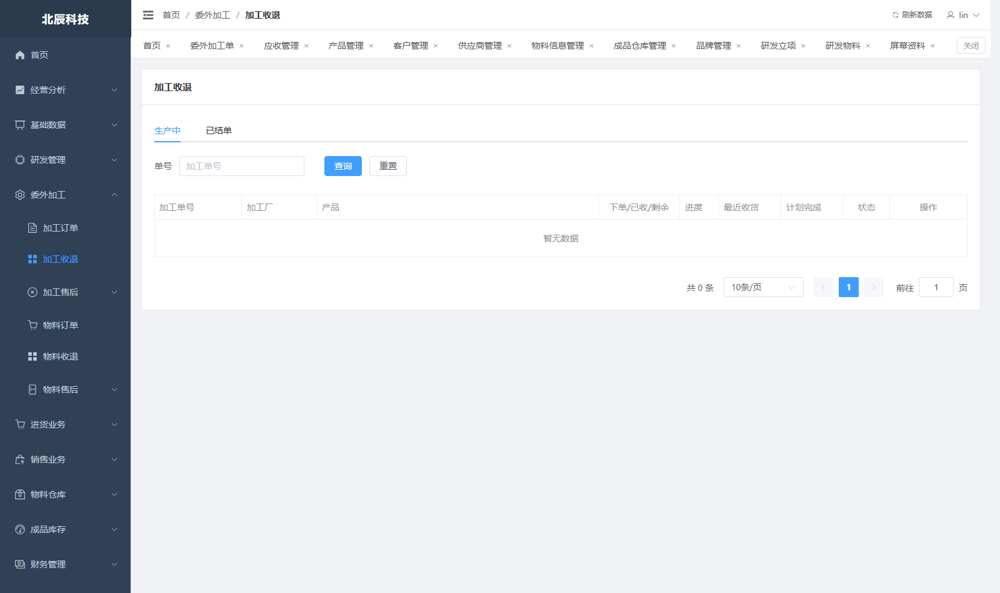

### 4.3.1 列表

- **页签**：生产中（默认） / 已结单；
- 列：加工单号、加工厂、产品、下单·已收·剩余、进度、最近收货、计划完成、状态；
- 操作：**收货 / 退货**（已结单页签为"收货详细 / 结单报表"，只读）；
- 筛选：加工单号。

### 4.3.2 收货操作步骤

1. 在列表点该单的「收货」（或进详情后点工具栏「新增收货」）；
2. 弹窗填写：

| 字段 | 必填 | 说明 |
|---|---|---|
| **产品名称** | **是** | 选自该加工单的产品行 |
| 总数量 | 自动 | = 四档之和，**只读** |
| **A规 / B规 / C规 / 不良 数量** | 至少一档 >0 | 整数；**各档之和必须等于总数量** |
| **收货仓库** | **是** | 入库的自有成品仓 |
| 收货日期 / 物流单号 / 备注 / 收货图片 | — | — |

3. 保存为**草稿** → 点「审核」才真正入库。

**收货审核后发生什么**：

| 维度 | 变化 |
|---|---|
| **加工厂委外仓 · 物料** | **扣减**：按 BOM 需求（单套用量 × 收货数量）扣；**允许扣成负数**（缺料时前端会二次确认"物料将变为负数"） |
| **我方成品仓** | **增加**：按 A/B/C/不良 四档分别入账 |
| **账务** | 生成**正向应付**（收货数量 × 加工单价） |
| **成本** | 移动加权：本批单位成本 =（加工费 + 耗用材料成本）÷ 收货数量 |
| **上游** | "已收数量"增加（用于进度与剩余量） |

### 4.3.3 加工退货（红冲）

**两种发起方式**：

1. **有单退货**：在该加工单的收货详细页点「加工退货」，按产品行拆规格数量并选扣减的成品仓；
2. **无单退货（工厂售后）**：见 4.4。

**加工退货审核后发生什么**：

| 维度 | 变化 |
|---|---|
| 我方成品仓 | **扣减**（按所选规格） |
| 加工厂委外仓 · 物料 | **还回**（按 BOM 快照拆料加回） |
| 账务 | **负向应付**（冲减加工厂欠款） |
| 上游 | 红冲量从"已收"额度里还回去（净已收口径） |

**两条硬约束**：

- **已结单的加工单不能做有单退货**（"该加工单已结单，账务已清算；如需退货请走「工厂售后」办理"）；
- 累计退货**不能超过已收数量**。

### 4.3.4 超收与缺料（两处二次确认）

| 场景 | 行为 |
|---|---|
| **超收**（累计收货 > 订单数量） | 允许，但需二次确认"累计收货量(已收 − 退货 = 净 + 本次 = 合计)超出订单数量(N)，是否确认超收？"；确认后标记 `over_receipt=1` |
| **缺料**（委外仓物料不够扣） | 允许强制出库，需确认"以下物料库存不足：X 需要 N，库存仅 M，缺口 G —— 是否确认继续出库？（物料将变为负数）" |

### 4.3.5 收货记录的状态与动作

收货记录是普通单据三态：

- **草稿**：可编辑、审核、删除；**加工退货草稿**的终态是"作废"（进"已作废"页签留痕）；
- **已审核**：可反审核（在详情页）；
- 报错："仅草稿状态可以审核" / "仅已审核状态可以反审核" / "仅草稿状态可编辑，已审核记录请先反审核"。

**反审核的额外护栏**：该加工退货**已有"加工返回"记录**时禁止反审核（"请先在详情页逐条撤销返回后再反审核"）。

## 4.4 加工售后 · 工厂售后（GTW-）

**路径**：委外加工 → 加工售后 → **工厂售后**　**用途**：加工单**已结单**后才发现货有问题 → 退回**成品**给工厂（**工厂责任**），工厂修好送回时按**实际用料**生成对工厂的**赔料应收**。

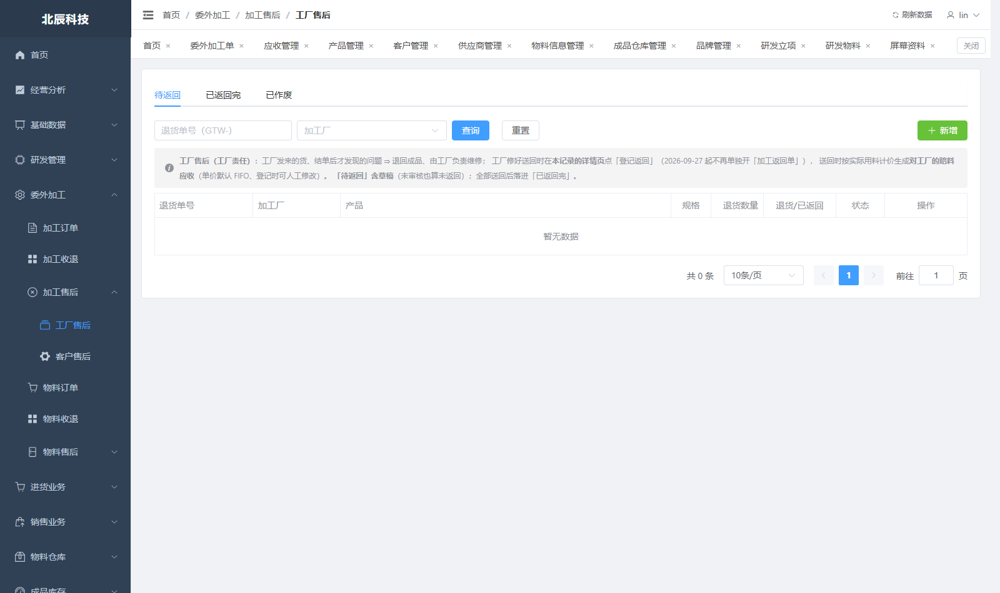

### 4.4.1 三个页签

| 页签 | 含义 |
|---|---|
| **待返回** | 含草稿 + 已审核但还没全返回的 |
| **已返回完** | 已审核且返回数量达标 |
| **已作废** | 被作废的草稿（留痕可查） |

### 4.4.2 新增（独立页面）

| 字段 | 必填 | 说明 |
|---|---|---|
| **加工厂** | **是** | 下拉排除"供货商"（加工退货只能退给加工厂/辅料商/方案商） |
| **扣减的成品仓库** | **是** | 自有成品仓，会显示该规格库存 |
| **产品** | **是** | 产品主数据 |
| BOM 快照 | — | 选完加工厂 + 产品后**自动带出**（默认最近一次，可换版本） |
| 退货规格 | — | A规 / B规 / C规 / 不良 |
| **数量** | **是** | 整数 |
| 备注 | — | — |

### 4.4.3 审核后（**不还料、不动应付**）

| 维度 | 变化 |
|---|---|
| 我方成品仓 | **扣减**成品 |
| 加工厂委外仓 | **增加**成品，形态 = **成品（加工退货）** |
| 账务 | **不动**（无单口径，工厂赔款在"返回"时才结算） |
| BOM | **不拆料**（刻意不还料——料在"登记返回"时按实际用料处理） |

### 4.4.4 登记返回（在记录详情页）

工厂把货修好送回时：进入该记录的**详情页** → 点「**登记返回**」：

| 字段 | 说明 |
|---|---|
| 回仓仓库 | 修好成品回到的我方仓 |
| 回仓品质 | A/B/C/不良 |
| **实际用料明细** | 从本单 BOM 快照里选物料 + 填数量（**可超 BOM 标准用量**）；池为空时**允许只登记返回、不填料** |
| 用料单价 | 默认按 FIFO 带出，**可人工修改**（改过会留痕"人工定价"） |
| 返回日期 / 备注 | — |

**注意**：登记返回**只生成草稿**，点「审核」才落账。

**返回审核后（三条腿同时落账）**：

1. **核销在厂成品**（委外仓"成品（加工退货）"行扣减）；
2. **修好的成品回我方仓**（按回仓品质）；
3. **按实际用料扣委外仓物料 + 生成对加工厂的应收（赔料）**。

反审核 = 三条腿对称逆回 + 冲销应收（记录回到草稿，**留痕**，与"删除草稿"不同）。

## 4.5 加工售后 · 客户售后（OR-）

**路径**：委外加工 → 加工售后 → **客户售后**　**用途**：客户退回我方的售后品，推给工厂维修（**我方责任，我方付维修费**）；修好后登记维修返回入库，全部返回后可**结案**。

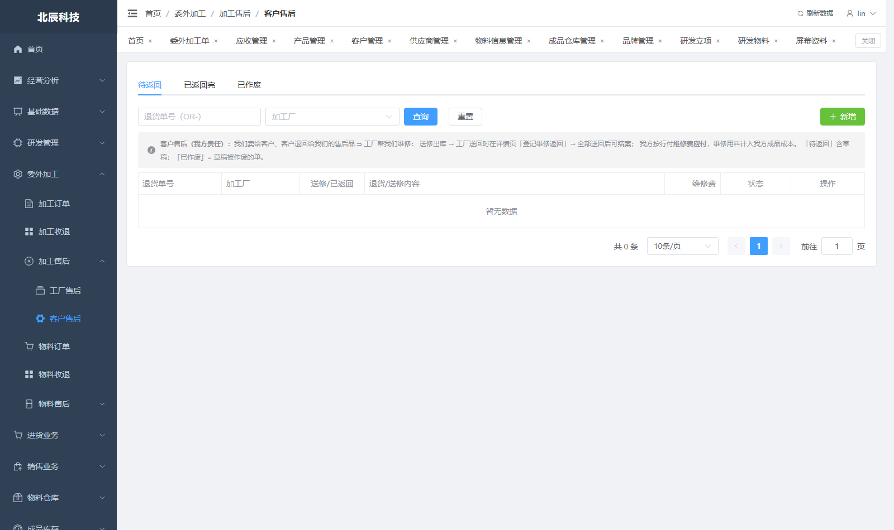

### 4.5.1 新增（客户售后 = 成品维修退货）

| 字段 | 必填 | 说明 |
|---|---|---|
| 退货类型 | — | 本页固定"维修退货"（REPAIR） |
| **加工厂** | **是** | 必须是加工厂类型 |
| **送修出库仓** | **是** | **自有成品仓**（送修的货从这里扣） |
| 关联加工单 | — | **维修退货不允许关联加工单**（选了会被拦） |
| **返回/送修行** | **是** | 产品 + BOM 快照（可换版本）+ 退回规格（**维修退货只能是"不良品"**）+ 送修数量（整数） |
| 送修日期 / 备注 | — | — |

### 4.5.2 审核后（送修）

| 维度 | 变化 |
|---|---|
| 我方送修出库仓 | **扣减**成品 |
| 加工厂委外仓 | **增加**成品，形态 = **成品（维修退货）** |
| 账务 | **不冲减应付**（维修不是退货，原加工费照付）；**维修费在"登记维修返回"时才挂应付** |

### 4.5.3 登记维修返回（详情页）

| 字段 | 说明 |
|---|---|
| 入库仓库 | 默认该单送修出库仓，可改 |
| 返回日期 | — |
| 每行「本次返回」 | 上限 = 送修数量 − 已返回数量 |
| 实际用料（子物料） | 从送修物料的**子物料**里选，数量可超；从供应商委外仓扣账；**无赔料应收**（补料到仓需先开"物料发料单"） |
| 维修费 | 按返回产品行填写（工厂向我方收取） |

**返回审核后**：成品入库 + 核销在厂 + 实际用料/成本结转 + **按返回行挂维修费应付**。

### 4.5.4 结案与撤销结案

- 当某单的"未返回 = 0"时，列表操作列出现「**结案**」：确认后该单收尾；
- **结案后**：不能登记/撤销维修返回，也不能反审核（需先「撤销结案」）；
- 「已结案」以标签形式与单据状态并列显示（状态仍是"已审核"）。

## 4.6 物料订单（MWO-）

**路径**：委外加工 → 物料订单　**用途**：向供应商（加工厂 / 辅料商）采购或委外加工**物料**（玻璃、驱动IC、排线等），是物料收料与结算的依据。

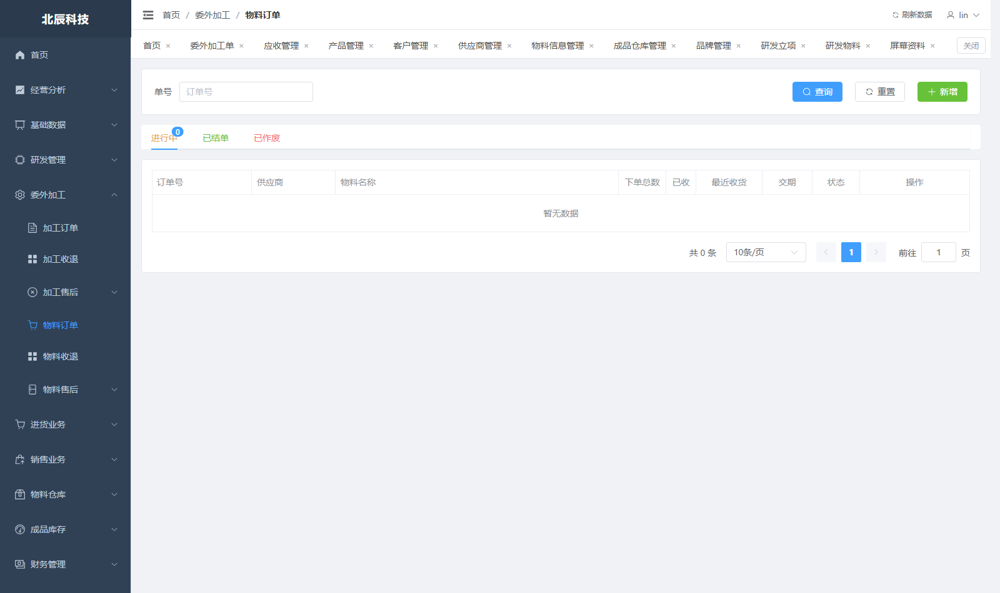

### 4.6.1 列表与页签

- **页签**：进行中（待审核 + 生产中） / 已结单 / 已作废；
- 列：订单号、供应商、物料名称、下单总数、已收、最近收货、交期、状态；
- 操作：详情、下载合同、审核、作废；
- 筛选：单号。

### 4.6.2 新增

| 字段 | 必填 | 说明 |
|---|---|---|
| **订单类型** | — | **采购** / **委外**；切换会清空供应商，并影响供应商标签（加工厂/供应商）与单价列名（加工费单价/单价） |
| **供应商 / 加工厂** | **是** | 随订单类型变化 |
| 交期 / 备注 | — | — |
| **物料明细行** | **至少 1 行** | 先选**类型**才能选**物料** → 自动带出单位 → 填数量（**整数**）→ 加工费单价/单价 |

### 4.6.3 状态与动作

| 状态 | 文案 | 动作 |
|---|---|---|
| `PENDING` | 待审核 | 编辑、审核、作废、结单 |
| `RECEIVING` | **生产中** | 反审核（**仅当该单没有任何收货记录**）、收货、退货、结单、作废 |
| `FINISHED` | 已结单 | 只读；可反结单、**仍可退货** |
| `CANCELLED` | 已作废 | 只读 |

- **审核本身只改状态**（不动库存与账务）；
- **结单不要求收满**，界面会提示"尚未收满（已收 X / 下单 Y），结单后本页不可再收货 —— 确认结单？"；
- **反结单**：回到生产中（若从未审核/从未收货则回待审核）；
- 有收货记录时**不能反审核、不能作废**。

## 4.7 物料收退（收料 / 退不良 / 退货）

**路径**：委外加工 → 物料收退　**用途**：按物料订单登记**收料**，以及**退不良**和**物料退货**。

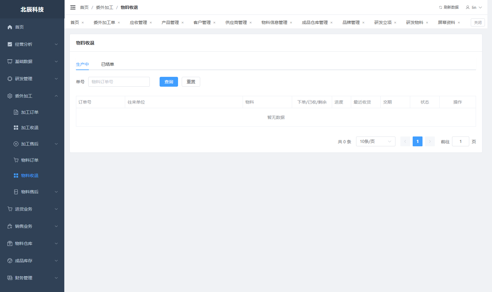

### 4.7.1 列表与详情

- **页签**：生产中 / 已结单；
- 列表列：订单号、往来单位、物料、下单·已收·剩余、进度、最近收货、交期、状态；操作：**收货 / 退货**；
- 详情页有 4 个汇总卡（订单总量/已收/剩余/进度）+ 工具栏（新增收货、物料退货、结单、反结单）+ 收货记录表。

### 4.7.2 新增收货

| 字段 | 说明 |
|---|---|
| **收货仓库** | 目标仓（委外仓或自有辅料仓） |
| 每行「本次收货数量」 | 整数；界面会显示"已收（=已收−已退不良）""下单数""剩余可收"；**超收需二次确认** |
| 子物料行（可展开） | 委外类型订单收料时会**扣子物料**（可强制出库） |

### 4.7.3 三种记录类型的审核影响（**这张表要记住**）

| 记录类型 | 库存 | 账务 | 订单数量 |
|---|---|---|---|
| **收料** `RECEIVE` | 目标仓良品 **+**；委外订单扣子物料 | **正向应付** = Σ(单价×数量) | 已收 **+** |
| **退不良** `DEFECT_RETURN` | 目标仓良品 **−** | 只有选"**折现退款**"才生成**负向应付**；选"**维修退货**"不动账 | 已退不良 **+**（影响净已收） |
| **退货** `RECEIVE_RETURN` | 目标仓良品 **−** | **负向应付**（冲减应付） | 已收 **−**（货回到"未收"，可重新收或重下单） |

> **退不良**的两种处理方式（弹窗里选）：
> - **维修退货**：货退回去修，不涉及退款；
> - **折现退款**：供应商按货值退钱，生成负应付。

**退货入口说明**：「物料退货」**就在本页的收货详细页**（列表行的「退货」按钮），不需要去别处。

### 4.7.4 反审核

严格对称逆回：库存逆向、按单据 ID 统一冲回应付（正负一起冲）、数量回滚。**已付款的应付会被拦住**，需先反审核付款单。

### 4.7.5 常见错误

| 提示 | 处理 |
|---|---|
| 只有生产中（RECEIVING）的订单可收货 | 订单已结单/作废，收不了 |
| 收货数量超过该物料下单数量：物料「X」下单 A、已收 B、本次 C | 调整数量或改订单数量（建单时确认过超收的可放行） |
| 退货数量超过该物料已收数量：…（可能已被另一张退货单占用） | 刷新后重试或调整数量 |
| 收货明细关联的物料订单明细行不存在 | 订单被改过，删掉本单重新收货 |

## 4.8 物料售后 · 工厂维修（MRW-）

**路径**：委外加工 → 物料售后 → **工厂维修**　**用途**：把物料送供应商维修，修好送回（可分批），全部返回后可结案；填了维修费则生成对供应商的应付。

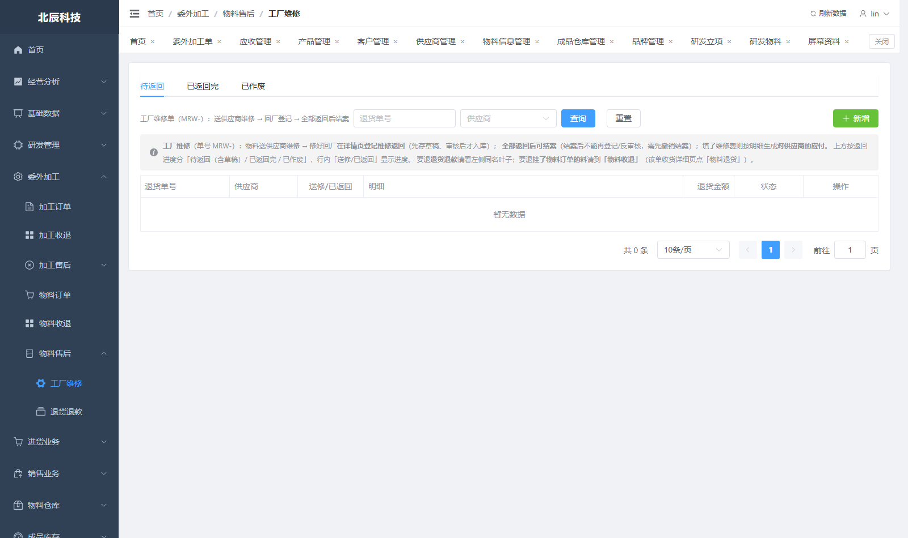

### 4.8.1 新增

| 字段 | 必填 | 说明 |
|---|---|---|
| 退货类型 | **是** | 选 **工厂维修**（REPAIR） |
| **维修供应商** | **是** | 排除"供货商"类型 |
| **出库源仓** | **是** | 选后加载"可送修物料"（源仓良品库存） |
| 送修日期 / 备注 | — | — |
| **明细行** | 至少一行 | 物料、单位、可送修数量、**送修数量（整数）**、**维修费单价（留空=不收费）** |

### 4.8.2 审核后（送修）

1. 出库源仓**扣减**物料；
2. 转入**供应商委外仓**，形态 = **物料（送修在厂）**；
3. 有维修费时生成**对供应商的应付**（备注含单号）。

### 4.8.3 登记维修返回

在详情页点「登记维修返回」：**入库仓库**（默认回到出库源仓）、**返回日期**、每行「本次返回」（上限 = 送修 − 已返回）、**实际用料（子物料）**（只能从送修物料的子物料里选，数量可超，从供应商委外仓扣账，**无赔料应收**）。

审核后：物料入库 + 核销在厂 + 回补订单收料数 + 实际用料成本结转。

### 4.8.4 结案

未返回 = 0 时可「结案」；结案后禁止登记/撤销维修返回、禁止反审核。

## 4.9 物料售后 · 退货退款（MRH-）

**路径**：委外加工 → 物料售后 → **退货退款**　**用途**：把物料退回供应商，供应商把货款退给我们 → 生成**对供应商的应收**，后续用收款单核销。

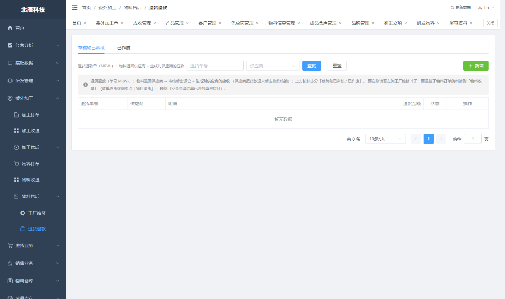

### 4.9.1 与"工厂维修"的区别

| | 工厂维修 | 退货退款 |
|---|---|---|
| 单据类型 | REPAIR | REFUND |
| 货去哪 | 供应商处**维修**，之后送回 | **退给供应商**，不回来 |
| 账务 | 有维修费时挂**应付** | 生成**应收**（供应商退钱给我们） |
| 页签 | 待返回 / 已返回完 / 已作废 | 草稿和已审核 / 已作废 |

### 4.9.2 审核后

1. 物料**出源仓**（源仓不足直接报错，不会出现负库存）；
2. 生成**对供应商的应收**（金额按明细单价或 FIFO）；
3. **不动关联订单的收料数**。

反审核：物料回源仓 + 应收台账作废留痕。

### 4.9.3 类型与关联订单的约束（容易踩坑）

| 规则 | 提示 |
|---|---|
| 退货退款 / 工厂维修**只能针对已结单的订单** | "该物料订单未结单：请改用「订单退料」（退货退款 / 维修返回 仅适用于已结单订单）" |
| 挂了未结单订单 | "该物料订单还没结单：请到「物料收退」的收货详细页点「物料退货」" |
| 源仓已无良品 | "该收料单的物料在当前源仓已无良品库存，无法按单退货" |

---

# 第 5 章 进货业务

> 进货业务指**成品**的采购（向供货商买成品）。三张单的关系：**采购单进货 → 发现问题 → 采购退货（退钱）或采购换货（换货）**。

## 5.1 成品采购单

**路径**：进货业务 → 成品采购单　**用途**：向成品供货商采购，**审核即入库并生成应付**（系统里没有单独的"采购入库单"，采购单审核就等于入库）。

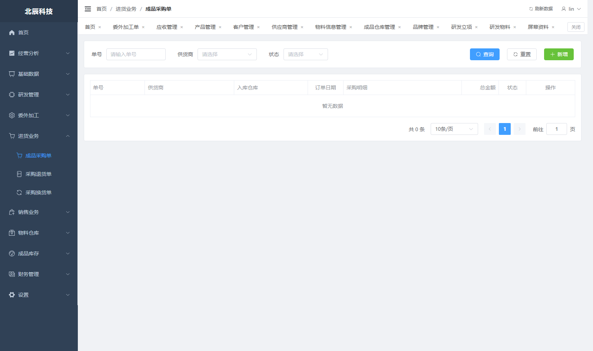

### 5.1.1 列表

- 列：单号、供货商、入库仓库、订单日期、采购明细、总金额、状态；
- 操作：详情；**已审核**的单可点「退货」「换货」（会带参数跳到对应新增页）；
- 筛选：单号、供货商、状态。

### 5.1.2 新增字段

| 字段 | 必填 | 说明 |
|---|---|---|
| **供货商** | **是** | 只能选"供货商"类型 |
| **入库仓库** | **是** | **只能选自有成品仓**（选错会被后端拒绝） |
| 订单日期 | — | 默认当天；**决定应付到期日（+1 个月）** |
| 含税 / 税率 | — | 开启含税默认 13%；税额自动计算 |
| 明细 | **是** | 产品、**品质（A/B/C/不良）**、数量（整数、>0）、单价 |

> 品质可以分四段录入（A规/B规/C规/不良），系统会按品质展开成多条明细。

### 5.1.3 审核后

| 维度 | 变化 |
|---|---|
| 库存 | 按明细**逐行入库**（仓库 + 产品 + 品质） |
| 成本 | 按明细单价做**移动加权** |
| 账务 | 生成**应付**（`YF-` 台账号，来源单号 = 采购单号 CG-；到期日 = 订单日期 + 1 个月） |

**反审核**：先检查（① 应付已核销 → 拦；② 该批库存已被后续单据消耗 → 拦）→ 逐行冲回库存 → 应付台账作废留痕 → 冲销成本批次 → 回草稿。

**作废**：仅草稿，只改状态。

## 5.2 采购退货单

**路径**：进货业务 → 采购退货单　**用途**：把已入库的成品退回供货商，**审核时从我方成品仓出库并生成负向应付（冲减欠款）**；若发生退货处理费/折让，**另生成一条正向应付**（我方付给供货商）。

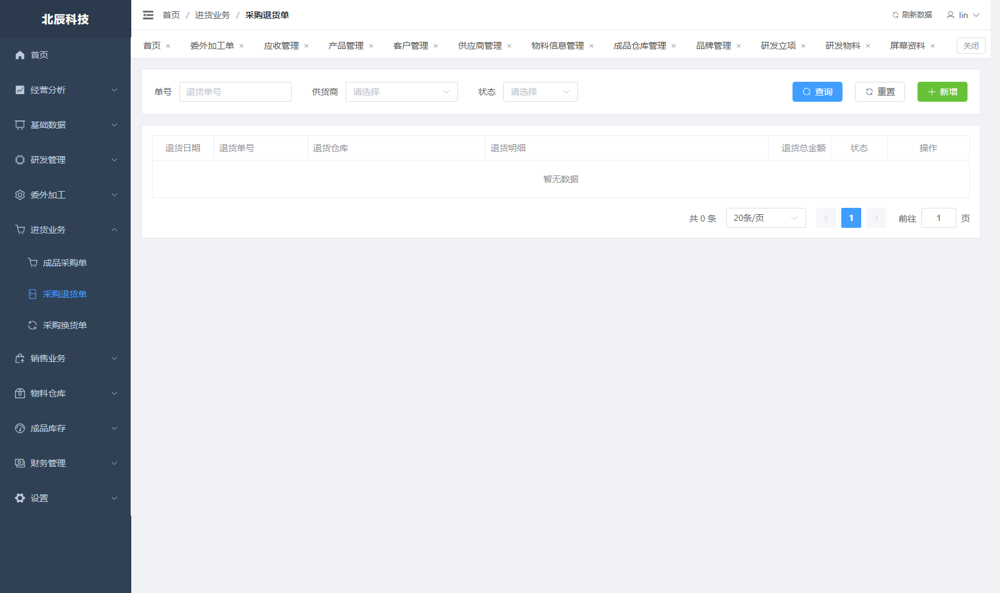

### 5.2.1 新增字段

| 字段 | 必填 | 说明 |
|---|---|---|
| **供货商** | **是** | — |
| **退货仓库** | **是** | 只能是自有成品仓 |
| 关联采购单 | 否 | 选了可「从采购单带入明细」，并校验**退货数量 ≤ 已购 − 已退** |
| 退货日期 | — | 默认当天（作应付到期日） |
| 明细 | **是** | 产品、品质、数量、单价；每行可填「**付费**」金额与类型（我方付给供货商） |
| 付费合计 / 付费说明 | — | 合计自动 = Σ 明细；说明写入台账备注 |

### 5.2.2 审核后

1. 逐行从退货仓**扣减**库存（不足会精确报缺口）；
2. 生成**负向应付**（冲减）；
3. 若填了付费：**另生成一条正向应付**（来源类型"采购退货付费"）。

**反审核**：查两类台账 → 拦"已核销/已转应收" → 逐行加回库存 → 台账作废留痕 → 回草稿。

### 5.2.3 付费类型怎么选

| 类型 | 用在什么场景 |
|---|---|
| **服务费 SERVICE** | 供货商收的换货/翻新/退货处理手续费 |
| **品质差价 DIFF** | 因品质差异产生的折让 |
| **全额货值 FULL** | 按货值全额赔付 |
| **其他 OTHER** | 兜底 |

## 5.3 采购换货单

**路径**：进货业务 → 采购换货单　**用途**：把采购来的成品（默认不良）退回供货商，同时**换回同品良品**；一张单管"退回出库 + 换入入库"，按两侧净额形成应付差额。

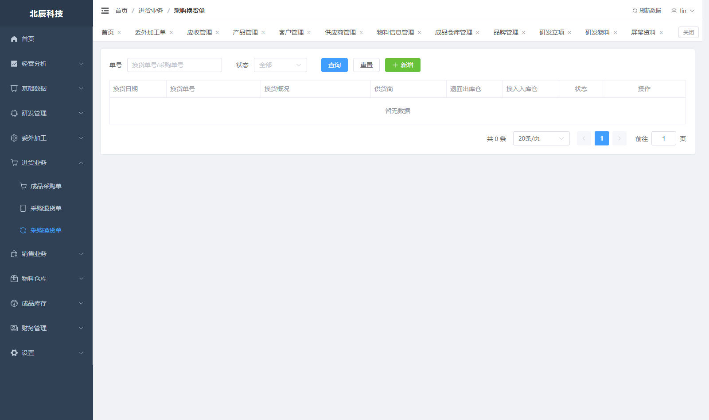

### 5.3.1 与"采购退货"的区别

| | 采购退货 | 采购换货 |
|---|---|---|
| 动作 | 只出不进 | **一出一进成对**（退回 + 换入） |
| 数量 | 独立 | 同行可不等量（退 2 换 1） |
| 账务 | 负向应付 +（可选）付费正向 | **两条对称应付**（退回负 / 换入正），净额即差价 |
| 是否必须关联采购单 | 否 | **否**（允许"无单换货"） |

### 5.3.2 新增字段要点

| 字段 | 说明 |
|---|---|
| **退回出库仓 / 换入入库仓** | 都必须是自有成品仓（可同一仓，按品质分行） |
| 来源采购单 | 可空；选了则退回数量受"可换量"约束，且**供货商必须与采购单一致** |
| 明细「退回产品/品质/数量/单价」 | 退回品质默认 **不良品** |
| 明细「换入数量/品质/单价」 | 换入数量默认 = 退回数量（1:1 可改）；换入品质默认 **A规**；**换入单价改高即"加价换新"**，差额进应付 |
| 表下合计 | 退回 X ｜ 换入 Y ｜ **应付净额 = Y − X** |

### 5.3.3 审核后

1. 退回侧：从退回仓按**退回品质**（默认不良）**出库扣减**；
2. 换入侧：向换入仓按**换入品质**（默认 A）**入库增加**；
3. 账务：**两条对称应付**（退回负向 + 换入正向），净额就是差价；填了付费则再生成一条正向应付；
4. 反审核时先校验"换入的良品是否已被后续单据消耗"。

---

# 第 6 章 销售业务

> 三条线：**销售单**（卖货，审核即出库 + 挂应收）→ **销售退货单**（客户退回，入"待整理"并冲应收）→ **销售换货单**（同一单里换货出去 + 收回来）。

## 6.1 销售单

**路径**：销售业务 → 销售单　**用途**：向客户销售成品，**审核即出库扣库存并生成应收**；可选"账期 / 现金"两种结算方式。

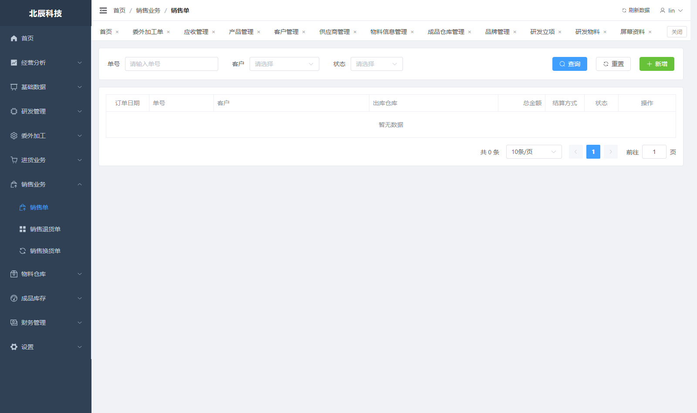

### 6.1.1 列表

- 列：订单日期、单号、客户、出库仓库、总金额、**结算方式**（账期/现金）、状态；
- 操作：详情；**已审核**可「退货」「换货」；草稿可审核、作废；
- 筛选：单号、客户、状态。

### 6.1.2 新增字段

| 字段 | 必填 | 说明 |
|---|---|---|
| **客户** | **是** | 可点「+ 新增」直接建客户 |
| **出库仓库** | **是** | 成品仓 |
| 订单日期 | — | 默认当天；决定应收到期日 |
| **结算方式** | **是** | **账期**（挂应收，后续收款） / **现金**（审核时自动收款到账） |
| 收款账户 | 现金时**必填** | 只列**启用**的账户；切到现金时默认带出现金账户 |
| 含税 / 税率 | — | 口径同采购单 |
| 明细 | **是** | 产品、**品质（只能 A规/B规/C规）**、数量（整数）、单价（>0） |
| 可用库存 | 只读提示 | 按 仓库+产品+品质 实时显示；不足会标红，可点「刷新库存」重拉 |

> ⚠️ **销售单不能卖"不良品/待整理"**，这是硬约束（前后端都会拦）。

### 6.1.3 审核后发生什么

| 维度 | 变化 |
|---|---|
| 库存 | 逐行从出库仓**扣减**（严格口径：不足直接拒绝，**不会出现负库存**） |
| 账务 | 生成**应收**（到期日 = 订单日期 + 客户账期月/天；账期都为 0 则当天到期） |
| 账期 CREDIT | 只挂应收，等收款单核销 |
| 现金 CASH | 除挂应收外，**自动生成一张收款单并立即审核**：核销应收 + 写资金流水 + 更新账户余额（等于当场到账） |

**现金结算的细节**：

- 同一张销售单**不会重复生成**自动收款单（幂等）；
- **反审核销售单时，自动收款单会被自动冲正**（已审核的先反审核冲流水，再作废留痕）；**人工创建的收款单不受影响**。

### 6.1.4 反审核

① 逐行回补库存 → ② 自动收款单冲正 → ③ 应收台账冲销（**已有收款记录会被拦住**："应收单…已有收款记录，不可反审核"）→ ④ 回草稿。

## 6.2 销售退货单

**路径**：销售业务 → 销售退货单　**用途**：客户退回商品，**审核后按"待整理"品质入自有成品仓并生成负向应收**（冲抵原销售应收）；退回品随后由「退货整理」分类。

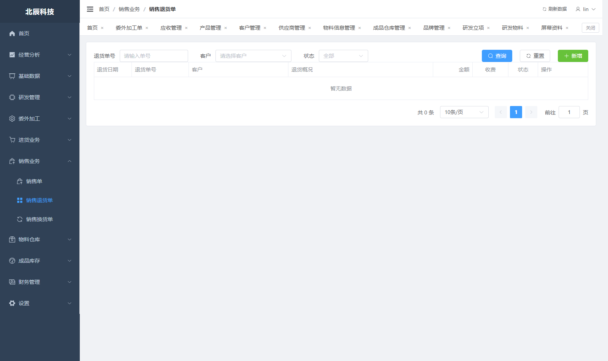

### 6.2.1 新增字段

| 字段 | 必填 | 说明 |
|---|---|---|
| **客户** | **是** | 改客户会清空已选销售单与明细 |
| **退货仓库** | **是** | **只能是自有成品仓**（提示：退回品按"待整理"品质入库，后续用退货整理单分流） |
| 关联销售单 | 否 | 选了才校验"退货 ≤ 已售 − 已退"，可「从销售单带入明细」 |
| 退货日期 | **是** | 作负向应收到期日 |
| 明细 | **是** | 产品、**品质（默认"待整理"）**、数量（整数、>0）、单价 |
| 收费 / 收费类型 / 收费说明 | — | 向客户**收取**的费用（如人为损坏维修费），逐行填写 |

### 6.2.2 审核后

1. 逐行**入库增加**（品质默认"待整理"，进自有成品仓）；
2. 登记"**待整理批次**"，供「退货整理」消费；
3. 生成**负向应收**（冲抵原销售应收）；
4. 若填了收费 → 另生成一条**正向应收**（单号带 `-FEE`）；
5. 反审核护栏：**已有货物被退货整理**时禁止反审核（"请先反审核对应的退货整理单"）。

### 6.2.3 关于"折损"

> 品质折损（如退回来的货只能当次品）**不在退货单上收钱**，而是在「退货整理」单上填"折损收款"，由整理单生成一条带 `-LOSS` 的应收。

### 6.2.4 删除与作废

- 列表**不提供删除**（"单据需留痕，只能作废"）；作废仅限草稿。

## 6.3 销售换货单

**路径**：销售业务 → 销售换货单　**用途**：同品换货——客户退回旧品（入"待整理"），我方发出新品；**换货本体不挂账**，只有"收费"才生成正向应收。

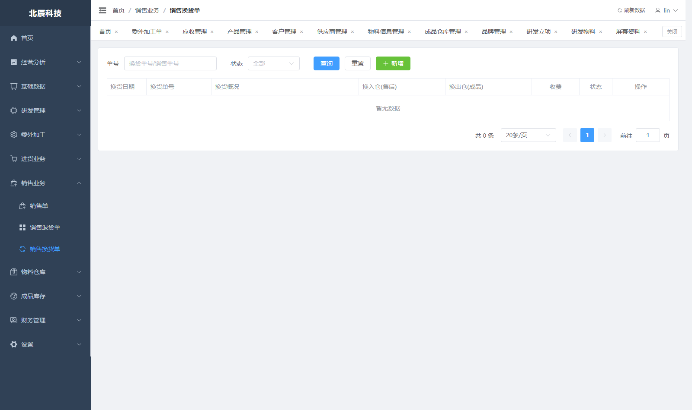

### 6.3.1 新增字段

| 字段 | 必填 | 说明 |
|---|---|---|
| **客户** | **是** | 已有单据上锁定（换客户等于换一张单） |
| **来源销售单** | **是（强关联）** | 先选客户才有下拉；选中后带出明细与出库仓 |
| **换入仓（售后）** | **是** | 退回品入此仓（自有成品仓） |
| **换出仓（成品）** | **是** | 默认取来源销售单的出库仓 |
| 换货日期 | **是** | 作收费应收到期日 |
| 明细「退回产品/数量」 | **是** | 数量受"可换数量"限制（= 已售 − 已退 − 已换） |
| 明细「换出数量/品质/单价」 | **是** | 换出数量默认 = 退回数量；**换出品质只能是 A/B/C** |
| 明细「收费」 | 条件必填 | **非 1:1 换货必须填收费**（差额无处挂账） |

### 6.3.2 审核后

1. 退回：入换入仓，**强制品质"待整理"**；登记待整理批次；
2. 换出：从换出仓按换出品质扣减（不足会精确报缺口）；
3. 账务：**换货本体不写台账**；只有收费时生成一条**正向应收**（单号带 `-FEE`）。

### 6.3.3 硬规则

- **非 1:1 必须收费**："换货明细「X」退回 a / 换出 b（非 1:1）：差额货物价值无处挂账，请为该明细填写「收费」金额后再审核，或在销售退货单中处理"；
- **只支持正向收费**：如果换出比退回便宜需要退款，请另开销售退货单。

---

# 第 7 章 库存管理

> 库存分两个目录：**成品库存**（8 个页面）与**物料仓库**（6 个页面）。它们思路一致，但**维度不同**——先把下面这张对照表看懂，后面就不会乱。

## 7.1 成品库存 vs 物料库存（先看这张表）

| 维度 | 成品库存 | 物料库存 |
|---|---|---|
| 管理对象 | 产品（有 SKU、单位、品牌、**安全库存**） | 物料（**无 SKU**、有物料类型） |
| 库存行的定位键 | 仓库 + **产品** + **品质（5 档）** + 形态 | 仓库 + **物料** + 形态（**不分品质**） |
| 品质 | A规/B规/C规/不良/待整理 | 只有"良品"实际记账（不良仅是展示位） |
| 负库存 | **绝对不允许** | **物料其他出入库允许**（委外历史口径）；移仓/报损不允许 |
| 仓库池 | 自有成品仓 | 委外仓 + 自有辅料仓 |
| 安全库存预警 | 有 | 无 |

## 7.2 库存详情与流水（看数用）

### 7.2.1 成品库存详情

**路径**：成品库存 → 成品库存详情

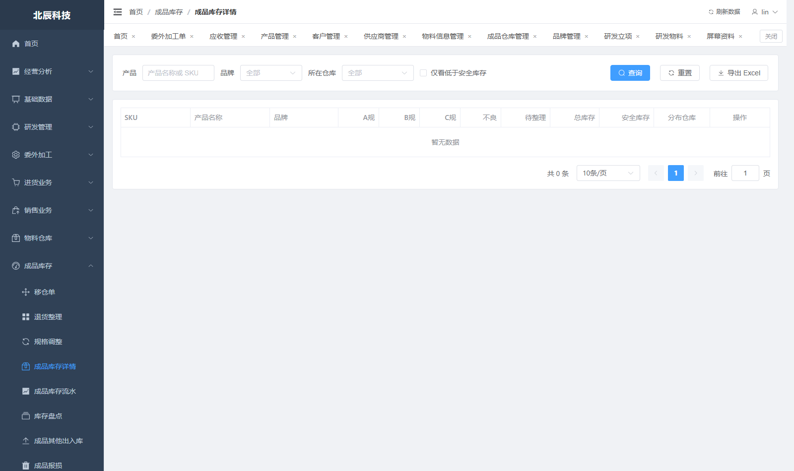

- 列表**按产品汇总**：SKU、产品名称、品牌、**A规/B规/C规/不良/待整理**、总库存、安全库存、分布仓库数；
- 筛选：产品（名称或 SKU）、品牌、所在仓库（可多选）、**"仅看低于安全库存"**；
- 点产品名 → 该产品的**仓库分布明细**（各仓各档数量、占比），可导出 Excel。

### 7.2.2 库存流水

**路径**：成品库存 → 成品库存流水（物料在"物料仓库 → 物料库存流水"）

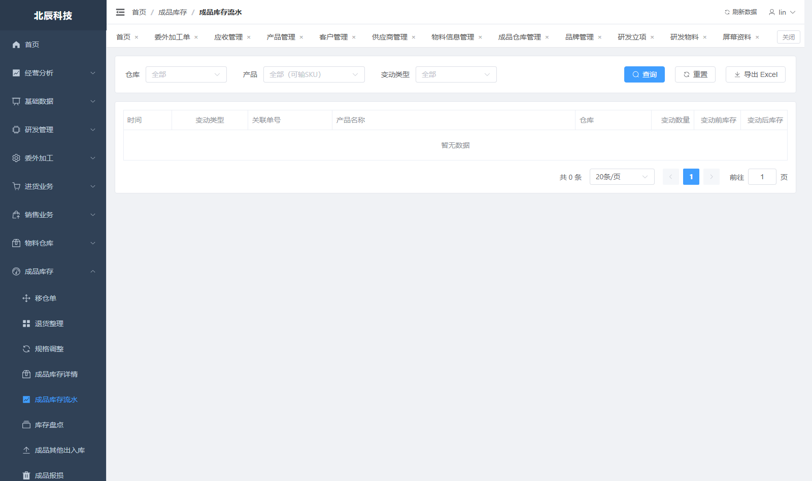

- 列：时间、**变动类型**（中文，如"销售出库""采购入库"）、**关联单号**（可点回原单据）、产品/物料、仓库、**变动数量、变动前库存、变动后库存**；
- 筛选：仓库、产品/物料、变动类型（60 多种）；
- 用途：**对账神器**——任何库存变动都能追溯到具体单据。

### 7.2.3 物料库存详情

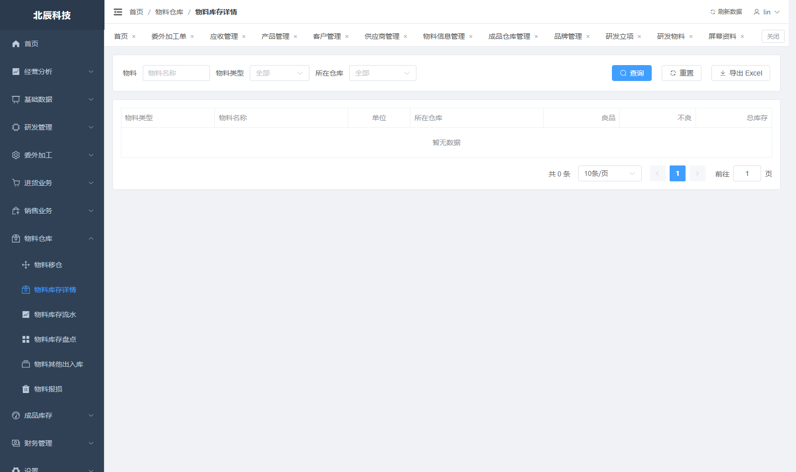

- 列表**按 仓库 × 物料**展示（不跨仓合并）：物料类型、物料名称、单位、所在仓库、良品、不良、总库存；
- 点进详情可见 **"送修在厂"** 列（即形态 = 物料（送修在厂）的数量），**不并入良品/不良**；
- 支持双 Sheet 导出（汇总 + 按仓库明细）。

## 7.3 移仓（仓库之间搬货）

**路径**：成品库存 → 移仓单 / 物料仓库 → 物料移仓

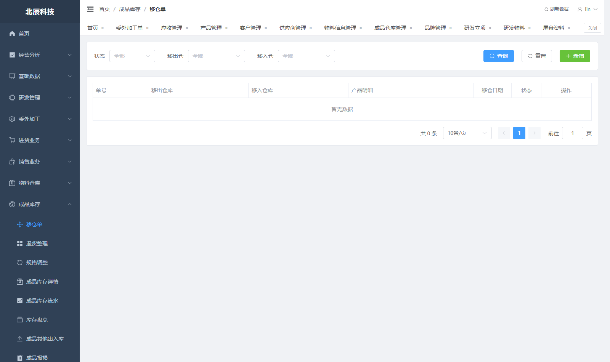

### 7.3.1 成品移仓

| 字段 | 说明 |
|---|---|
| **移出仓库 / 移入仓库** | 都必须是自有仓，且**不能相同** |
| 移仓日期 / 备注 | — |
| 明细 | 产品、**品质**（5 档可选）、数量（整数）、现有库存（提示用） |

- **审核**：移出仓 **−**、移入仓 **+**；**不改变加权价**；
- **反审核**：等量逆回（退回移出仓、从移入仓扣回）。

### 7.3.2 物料移仓

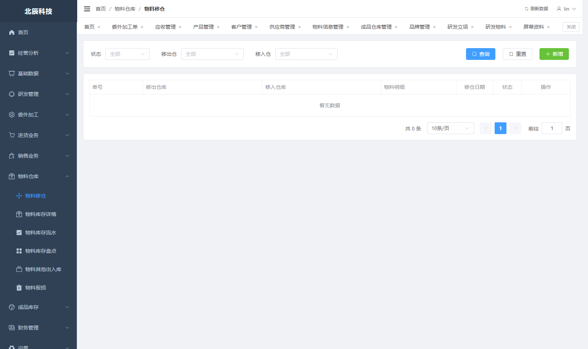

- 仓库池 = **委外仓 + 自有辅料仓**（常用于"我方辅料仓 → 加工厂委外仓"的发料）；
- 明细的"品质"字段**只做单据留痕，不参与库存**（物料库存不分品质）；
- **严格口径**：库存不足直接报错（不提供强制出库）。

## 7.4 库存盘点（重点）

**路径**：成品库存 → 库存盘点 / 物料仓库 → 物料库存盘点（**两者共用同一套操作面板**）

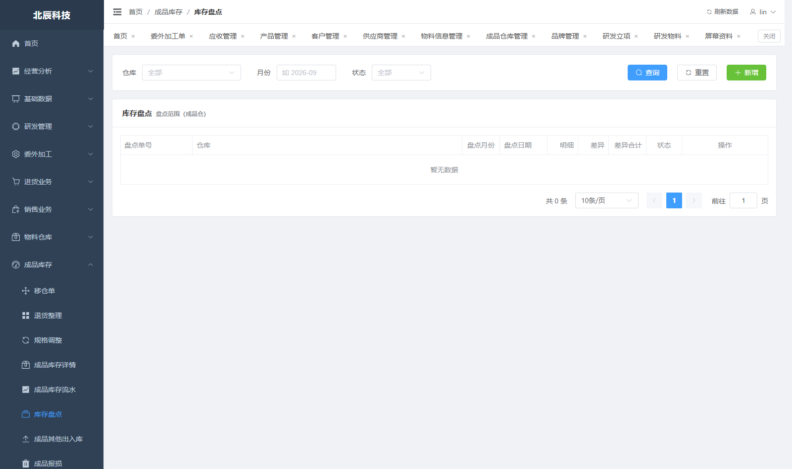

### 7.4.1 盘点五步

| 步骤 | 你要做的 |
|---|---|
| ① 开单 | 新建盘点单：**盘点仓库（必填）**、盘点月份（默认当月）、盘点日期、备注 |
| ② 快照 | 保存后系统**自动把该仓当前库存逐行抄成明细**（账面数量 = 快照） |
| ③ 录实盘 | 进明细页逐行填**实盘数量**（只有草稿可改）；保存时按**当前账面**算差异 |
| ④ 审核落账 | 审核后按差异**盘盈入库 / 盘亏出库**，库存调成实盘数 |
| ⑤ 反审核 | 差异取反冲回，单据回草稿 |

**同仓同月只能开一张盘点单**（"该仓库 2026-09 已存在盘点单，请勿重复创建"）。

### 7.4.2 ⚠️ 盘点期间**不会冻结库存**

这是最容易误解的一点：**盘点期间账面照常变动**——别人照样可以销售出库、移仓、报损。

系统的兜底办法是：**录实盘与审核时都以"当前账面"重算差异**，所以：

- 审核那一刻，库存 = 你填的实盘数（这是盘点要保证的）；
- 但盘点期间被其他单据挪动的数量，会被**一次性吸进差异**里。

> **实操建议**：盘点尽量选在业务低峰（如月末下班后），并在审核前**先查一眼库存流水**，确认没有其他单据正在变动。

### 7.4.3 权限提示

- 成品盘点的仓库池 = 自有成品仓；物料盘点的仓库池 = 委外仓 + 自有辅料仓；
- **物料库存盘点仅限"跟单专员"角色操作**（管理员兜底放行），非该角色会报 403。

## 7.5 其他出入库（手工调整库存）

**路径**：成品库存 → 成品其他出入库 / 物料仓库 → 物料其他出入库　**用途**：承载所有"非单据化"的库存增减（盘盈补记、样品、借用归还等）。

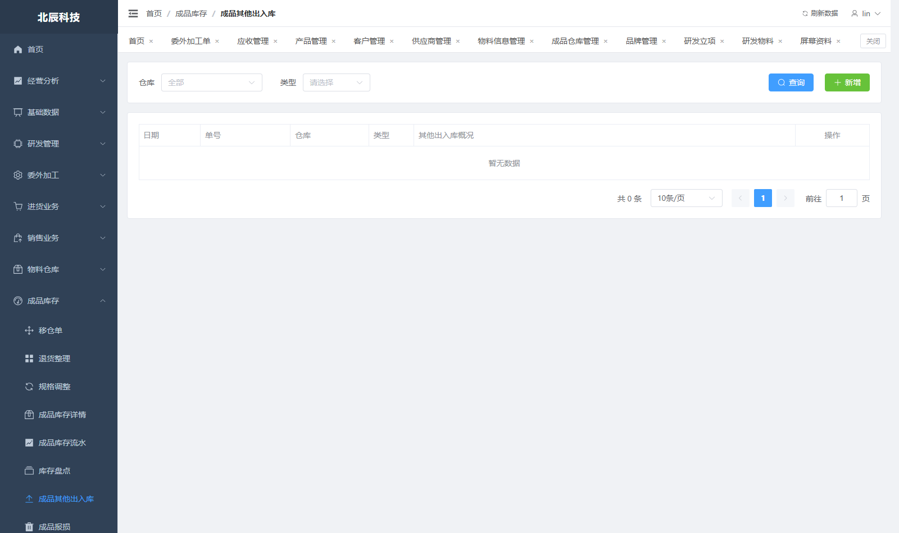

| 项 | 成品 | 物料 |
|---|---|---|
| 列表 | 顶部**入库/出库两个页签** | 同样分页签（物料页区分更明显） |
| 字段 | 仓库、类型（入库/出库）、日期、备注；明细：产品、品质（5 档）、数量 | 仓库、类型、日期、备注；明细：物料、**单价**（委外仓下会自动带加权单价）、数量 |
| **出库库存校验** | **严格**：不足直接拒绝（"库存不足，无法审核：产品名（A规，需 x，库存 y，缺 z）"） | **允许负库存**（委外历史口径，只打告警不拦截） |

**审核后**：入库 **+** / 出库 **−**；反审核对应逆回（入库 → 扣回；出库 → 加回）。

> ⚠️ 同样是"其他出入库"，成品与物料的出库校验**行为不同**——成品严格、物料允许负数。这是历史口径，请按实际仓库类型操作。

## 7.6 报损（库存报废 + 自动挂账）

**路径**：成品库存 → 成品报损 / 物料仓库 → 物料报损　**用途**：只出不进的报废（破损/变质/丢失/质量不合格/其他），**并自动联动财务**。

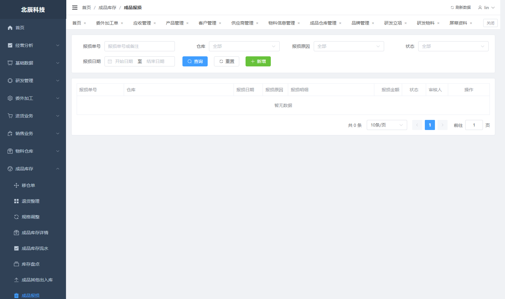

### 7.6.1 表单字段

| 字段 | 说明 |
|---|---|
| **仓库** | 成品=自有成品仓；物料=委外仓或自有辅料仓 |
| 报损日期 / 报损原因 | 原因：破损 / 变质 / 丢失 / 质量不合格 / 其他 |
| **损失承担方** | **内部损失**（默认）/ **供应商或加工厂承担** |
| 承担方 | **选"供应商/加工厂承担"时必填** |
| 明细 | 产品/物料、品质（成品）、数量（整数）、**单价（默认带出成本价）**、金额（自动算） |

### 7.6.2 审核后：库存 − + 财务腿

| 承担方 | 库存 | 财务 |
|---|---|---|
| **内部损失** | 扣减 | 生成一张「**报损损失**」**费用单**（**无账户 = 非资金**，不扣账户余额）；该费用单**生成即自动审核** |
| **供应商/加工厂承担** | 扣减 | 生成对**该单位的应收（索赔）** |

**反审核**：库存**加回** + 财务腿对称冲销（费用单作废 / 索赔应收冲回；**已被收款的应收会被拦**）。

### 7.6.3 常见错误

- "库存不足，无法报损：产品名（不良品，需 x，库存 y，缺 z）"；
- "损失由供应商/加工厂承担时，必须选择承担方"。

## 7.7 规格调整（同仓内改品质）

**路径**：成品库存 → 规格调整　**用途**：**同仓同产品内改变品质档位**（如"待整理 → A规""A规 → C规"），库存**总量守恒**。

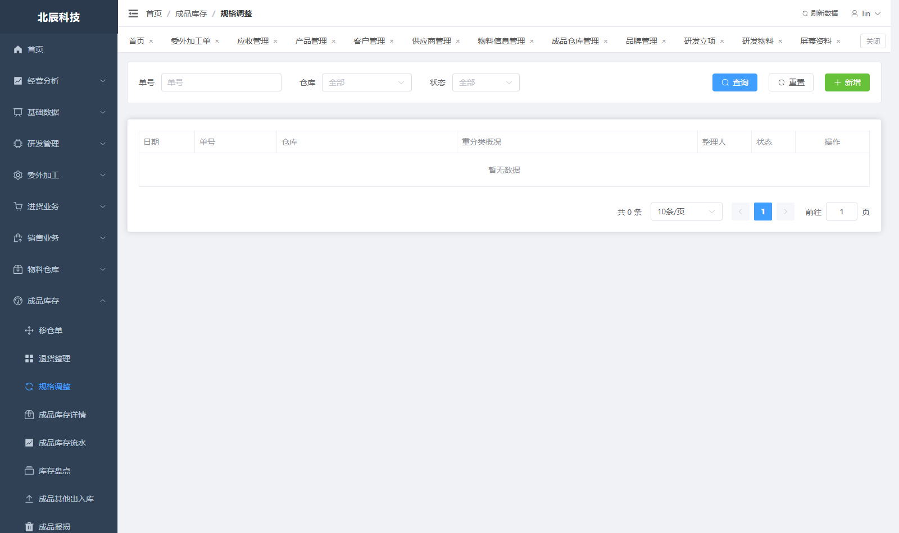

| 字段 | 说明 |
|---|---|
| **仓库** | 自有仓 |
| 明细 | 产品、**原品质**、**目标品质**（不能与原品质相同）、原品质可用库存（提示）、数量（整数） |

- **审核**：原品质 **−**、目标品质 **+**；
- **反审核**：等量逆回，但**状态落到"已作废"而不是回草稿**（这是全站唯一的例外，已作废后不能再审核，需要重新开单）；
- 审核前会一次性列清缺口："原品质库存不足，无法审核：产品名（A规，需 x，库存 y，缺 z）"。

## 7.8 退货整理（售后品的分选车间）

**路径**：成品库存 → 退货整理　**用途**：把售后退回压在成品仓的**待整理**品，按 A/B/C/不良**分选**后回仓，并可向客户收"折损"。

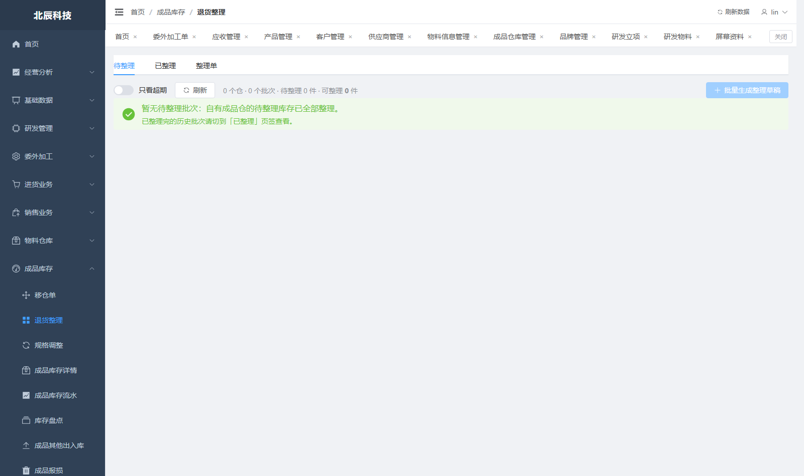

### 7.8.1 三个页签

| 页签 | 内容 |
|---|---|
| **待整理**（跨仓总览） | 所有还没整理的售后退回批次：来源单据（销售退货/换货）、客户、产品、待整理/已整理/可整理、**停留天数（>3 天标红"超期"）**；可勾选批量「生成整理草稿」 |
| **已整理** | 已整理完的批次 |
| **整理单** | 整理单列表（日期、单号、源仓库、整理概况、状态；操作：详情/审核/删除） |

### 7.8.2 整理操作

**批量生成整理草稿**：勾选批次 → 弹窗选「默认分选品质（A/B/C/不良）」「整理日期」「备注」→ 生成草稿。

**明细表单**：每行是"一条待整理批次"，可分别填 **A数量 / B数量 / C数量 / 不良数量**，**合计必须等于该行待整理数量**；另有「折损收款金额」（向客户收取的损失）。

### 7.8.3 审核后

1. 源仓的"**待整理**"行 **−** 总数量；
2. 按分选结果，**同一仓库**的 A/B/C/不良 各 **+** 对应数量（默认回到源仓）；
3. 累加来源批次的"已整理数量"（防同一批次被重复整理）；
4. **折损收款 > 0 时**：生成一条带 `-LOSS` 的**正向应收**（向客户收）。

**反审核**：对称逆回 + 折损应收冲销。

### 7.8.4 常见错误

| 提示 | 处理 |
|---|---|
| 产品[x]分选数量之和必须等于待整理数量 | 检查四档合计 |
| 产品[x]待整理数量 y 超过售后仓可用待整理库存 z | 刷新后重试（可能有其他整理单在操作） |
| 本单待整理批次涉及多个客户，无法确定折损收款对象，请按客户拆分整理单 | 拆单 |
| 只有草稿状态可删除 | 已审核需先反审核 |

---

# 第 8 章 财务管理

> 财务模块的核心逻辑：**业务单据审核 → 自动生成应收/应付台账 → 收/付款单核销台账 → 账单对账 → 资金流水记账**。
> 记住一句话：**台账是"欠条"，收付款单是"还钱"，账单是"对账单"，资金流水是"银行流水"。**

## 8.1 三个基础概念（先理解，后面才不迷路）

### 8.1.1 三套状态别混淆

| 状态体系 | 取值 | 用在哪 |
|---|---|---|
| **单据状态** | 草稿 / 已审核 / 已作废 | 收款单、付款单、费用单、账单、转应收单 |
| **台账结算状态** | 未结清 / 部分结清 / 已结清 / **已冲回** / 预付（预收） | 应收、应付台账 |
| **核销流水状态** | 有效 / 已冲销 | 核销关系（反审核据此精确冲回） |

> **重要**：应收/应付台账**没有"审核"按钮**——它们是被业务单据**自动生成**的；台账上的"已作废"是"来源单据被反审核冲销"的留痕，不是人工作废。

### 8.1.2 应收 / 应付的字段口径

| 字段 | 含义 |
|---|---|
| 单据号 | 应收=来源单据号（如销售单 `XS-…`）；应付=`YF-` 流水号（来源单号另列） |
| **业务场景**（来源类型） | 告诉你这笔账是"哪来的"（销售单 / 采购退货 / 委外加工收货 / 加工返回赔料 …） |
| 金额 / 已收（付） / 未收（付） | 未收 = 金额 − 已收 |
| **到期日** | 应收 = 订单日期 + 客户账期；应付 = 采购单日期 + 1 个月 / 退货日期等 |
| 状态 | 未结清 / 部分结清 / 已结清 / 预付(预收) |

### 8.1.3 哪些业务会自动产生账？（速查表）

| 业务动作 | 产生什么账 |
|---|---|
| 销售单审核 | **应收**（现金结算时再自动生成收款单） |
| 销售退货单审核 | 负向应收（+ 收费时正向应收） |
| 销售换货单审核 | 仅收费时正向应收 |
| 退货整理（折损） | 正向应收（带 `-LOSS`） |
| 采购单审核 | **应付**（到期 = 订单日期 + 1 个月） |
| 采购退货单审核 | 负向应付（+ 付费时正向） |
| 采购换货单审核 | 退回负向 + 换入正向（净额=差价） |
| 委外加工收货审核 | 正向应付（挂加工厂） |
| 加工退货审核 | 负向应付 |
| 委外结单超损 | 负向应付 |
| **加工返回（工厂赔料）** | **对加工厂的应收** |
| 客户售后维修返回 | 正向应付（维修费） |
| 物料收料 / 退不良 / 退货 | 正向 / 负向应付 |
| **物料退货退款** | **对供应商的应收** |
| 物料工厂维修 | 有维修费时正向应付 |
| 报损（内部/供应商承担） | 费用单（非资金）/ 对供应商应收 |
| 研发支出 | 费用单（自动审核或降级草稿） |

## 8.2 应收管理

**路径**：财务管理 → 应收管理　**用途**：**只读**查看应收台账（不产生单据）。

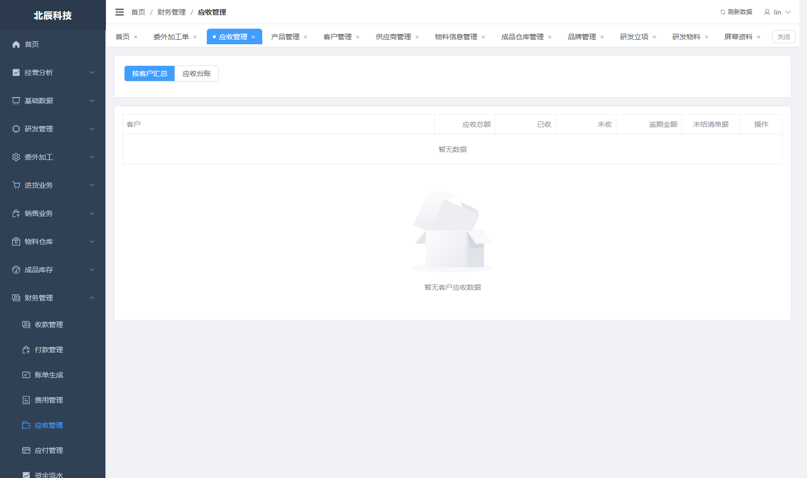

- **两个视图**：
  - **按客户汇总**：客户、应收总额、已收、未收、**逾期金额**、未结清单据数；点客户进"客户应收工作台"；
  - **应收台账**：两个页签（**客户应收** / **供应商应收**），列 = 单据号、往来单位、来源、应收金额、已收、未收、到期日、状态；
- 筛选：客户（或供应商）、状态、单号；
- **逾期口径**：未收 > 0 且 **到期日 < 今天**（当天到期不算逾期）；**没有到期日的单据不计入逾期**（界面会提示"N 张无到期日"）。

## 8.3 应付管理

**路径**：财务管理 → 应付管理

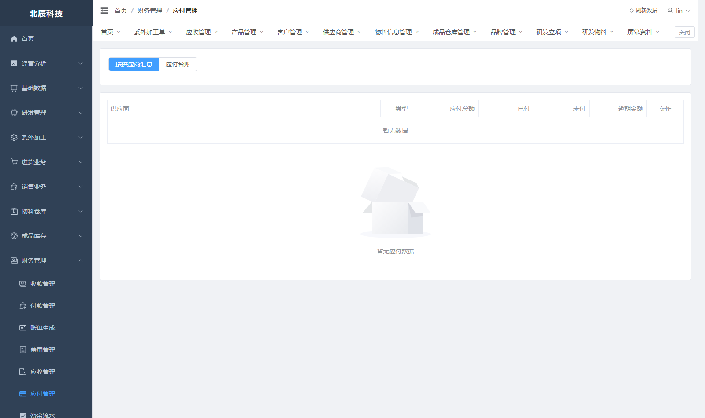

- **按供应商汇总** + **应付台账**（页签：全部/供货商/加工厂/辅料商/方案商）；
- 台账列：单据号、供应商、类型、**业务场景**、应付金额（**负数标红** = 退货/扣款冲减项）、已付、未付、到期日、状态；
- 筛选：供应商、**业务场景**（可按"委外加工收货""采购退货"等来源筛）、状态、单号；
- **「转应收」按钮**：只有**负数且未结清且未转过**的应付才出现（见 8.11）。

## 8.4 收款管理

**路径**：财务管理 → 收款管理　**用途**：实际收款的作业台——一边按账户入账（写资金流水），一边**核销应收**；差额自动挂"预收"。

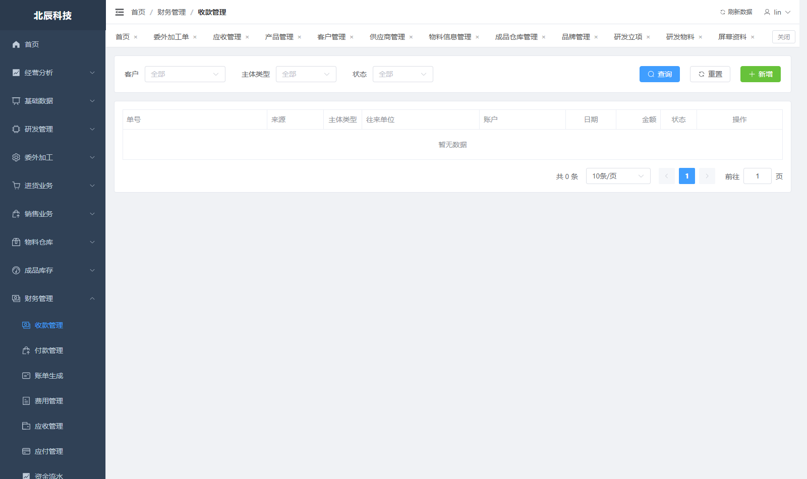

### 8.4.1 新增表单

| 字段 | 必填 | 说明 |
|---|---|---|
| **主体类型** | **是** | 客户收款 / 供应商收款（切换会清空往来单位与核销明细） |
| **客户 / 供应商** | **是** | 选后自动拉出**可核销的未结清应收** + 欠款汇总（总欠款/到期欠款） |
| 收款日期 / 备注 | — | 默认当天 |
| **收款账户（分款明细）** | **是** | 可加多行：账户 + 金额（>0）；**同一账户不能重复行** |
| 收款金额 | 只读 | = 各账户分款合计 |
| **核销明细**（开关，**默认关**） | — | 关 = 只记收款，全额挂**预收**；开 = 逐行选应收单据 + 核销金额 |

### 8.4.2 审核后（同一事务里做 4 件事）

1. 逐行**核销应收**（未收减少，状态自动变"部分结清/已结清"）；
2. 若核销额超过未收额 → 原应收全额结清，**超出部分生成一条负数应收（预收）**，备注"收款预收（多收，我方欠客户）"；
3. **按分款明细逐条写资金流水**（收入），账户余额随之增加；
4. 未核销差额 → 生成**预收台账**。

**反审核**：逐条反向冲销（核销流水置"已冲销"**留痕不删除**）+ 预收台账作废 + 逐账户写"收款冲正"流水 + 回草稿。

### 8.4.3 硬校验

| 提示 | 含义 |
|---|---|
| 收款方与被核销应收的往来单位不一致 | 防 A 客户核销 B 客户的账 |
| 预收台账不能作为核销目标 | 预收（负数应收）不能再被核销，需走退款 |
| 台账未收额已被并发核销，请刷新后重试 | 多人同时操作同一笔账 |

## 8.5 付款管理

**路径**：财务管理 → 付款管理　**用途**：与收款**完全镜像**的出账作业台。

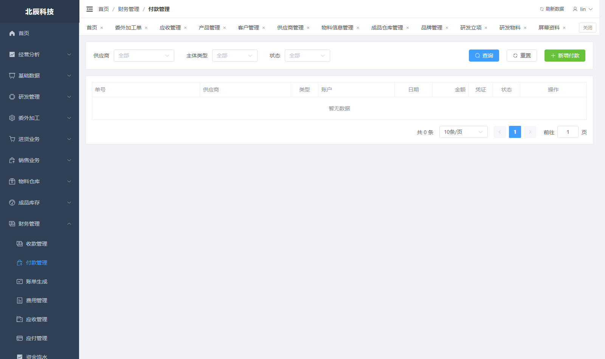

- 字段：**供应商**（必填）、欠款情况、付款日期、**付款凭证**（图片）、备注、**付款账户分款明细**、核销明细开关；
- 审核时**逐账户校验余额**（行锁 + 当前读）："账户「X」余额不足：当前余额 A，本次付款 B"；
- 审核后：核销应付 + 逐账户写"付款"流水 + 差额生成**预付台账**；
- 反审核：对称冲销（含补回"部分结清"状态）+ 写"付款冲正"流水；
- 校验："付款供应商 ≠ 被核销应付供应商"会被拒绝。

> **反审核入口**：收款/付款的**反审核按钮在列表页**（详情页只允许草稿态修改）。

## 8.6 账单生成（对账单）

**路径**：财务管理 → 账单生成　**用途**：把**同一往来单位**在某账期内所有"未结清/部分结清"的应收（或应付）**合并成一张对账单**，用于与客户/供应商对账、盖章、导出 Excel。**账单本身不动钱、不核销**。

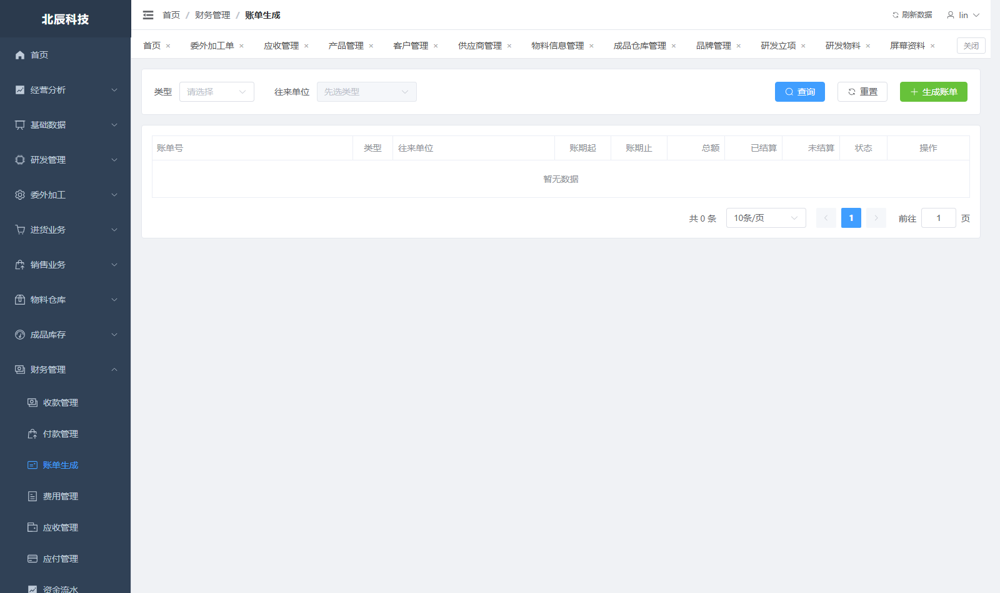

### 8.6.1 生成账单

点「生成账单」填写：

| 字段 | 必填 | 说明 |
|---|---|---|
| **类型** | **是** | 应收 / 应付 |
| **往来单位** | **是** | 按类型切客户/供应商（**"全部"类型下该下拉禁用**——客户与供应商主数据独立，混筛会串号） |
| 账期起 / **账期止** | 账期止必填 | 取数范围（到期日 ≤ 账期止 或 无到期日） |

**取数规则**（理解为什么金额是这些）：

- 应收侧：该客户所有未结清/部分结清的应收（放行"无到期日"的记录，避免漏行）；
- **剔除已被其他未作废账单引用的台账**（同一笔账不会出现在两张账单里）；
- **没有可出账台账会拒绝生成**（"该往来单位在账期…内没有可出账的未结清应收/应付，无需生成账单"）；
- 同一"类型 + 往来单位 + 账期止"的**未作废账单唯一**（防重复出账）。

### 8.6.2 账单状态与动作

| 状态 | 动作 |
|---|---|
| 草稿 | 审核、作废 |
| 已审核 | **反审核**、作废、**导出 Excel**（带公司抬头、逾期天数、人民币大写、签字区，可打印） |

**审核后只改状态**——不生成流水、不改账户。但之后收/付款核销被账单引用的台账时，账单里的"已收/已付"会**自动跟着更新**。

### 8.6.3 自动出账（了解即可）

系统每天**凌晨 2:00** 会自动跑一次：对"已到期且未结清"的应收/应付，按客户/供应商**自动生成草稿账单**（仍需人工审核）。

- 页面上另有「**立即执行**」按钮，可手动跑一轮（默认**只跑当前公司**，适合临时补账；跨公司批量仅超管可用）。
- 多实例部署时建议只在一个实例上开启该定时任务；任务内部也带跨实例互斥锁，重复触发不会重复出账。

## 8.7 费用管理

**路径**：财务管理 → 费用管理　**用途**：登记经营性支出（办公/房租/工资/运输/差旅/招待/**研发**/报损损失/其他），**审核后从资金账户扣款**。

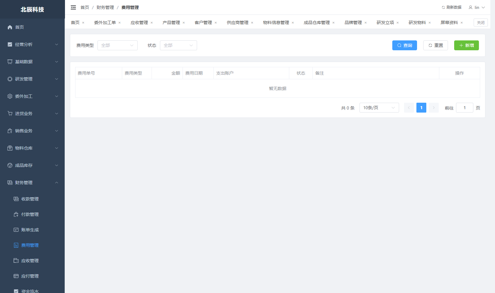

| 字段 | 必填 | 说明 |
|---|---|---|
| **费用类型** | **是** | 办公费/房租水电/工资社保/运输费/差旅费/业务招待/**研发支出**/**报损损失**/其他 |
| **金额** | **是** | >0 |
| 费用日期 | — | 默认当天；**分析报表按此日期归月** |
| **支出账户** | 条件必填 | 选"报损损失"时**禁用并置空**（它属于非资金费用）；由业务单据自动带出的费用**可以没有账户** |
| 备注 | — | 同时写入资金流水备注 |

**审核后**：

- **有账户**（资金费用）：校验账户未停用 + 余额足够 → 写一条"费用支出"流水，**账户余额实时减少**；
- **无账户**（非资金费用，如存货损失）：**不写流水、不扣账户**，直接生效。

> 列表里无账户的费用会显示"**非资金（无账户）**"，这不是漏填。

**反审核**：有账户的写一条"费用冲正"把钱退回账户；无账户的直接回草稿。

**手工建单的小规则**：手工录入时系统会**清空来源字段**（防止伪造"由业务单据带出的非资金费用"）。

## 8.8 账户管理

**路径**：财务管理 → 账户管理　**用途**：维护资金账户（现金/银行/微信/支付宝）与期初余额。

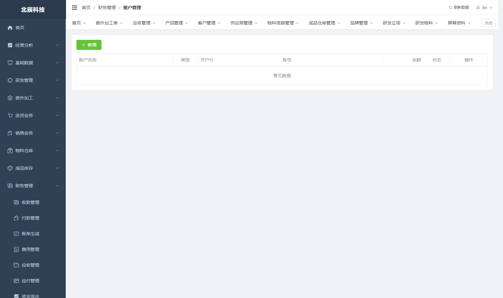

| 字段 | 必填 | 说明 |
|---|---|---|
| **名称** | **是** | **同公司内不可重复（含已停用）** |
| **类型** | **是** | 现金 / 银行 / 微信 / 支付宝 |
| 开户行 / 账号 | — | 账号同时作为期初流水的关联单号兜底 |
| 期初余额 | — | ≥0；**开户后不可修改**；>0 时自动写一条"期初"流水 |
| 状态 | — | 启用 / 停用 |

**余额怎么来的**：余额**不落库**，用"期初 + Σ(收入 − 支出)"实时算出（可在资金流水页逐笔核对）。

**停用影响**：停用后**不能用于收款/付款/费用支出**（历史流水与余额保留）。

## 8.9 资金流水

**路径**：财务管理 → 资金流水　**用途**：所有账户变动的**唯一事实来源**（只读，不能新增/修改/删除）。

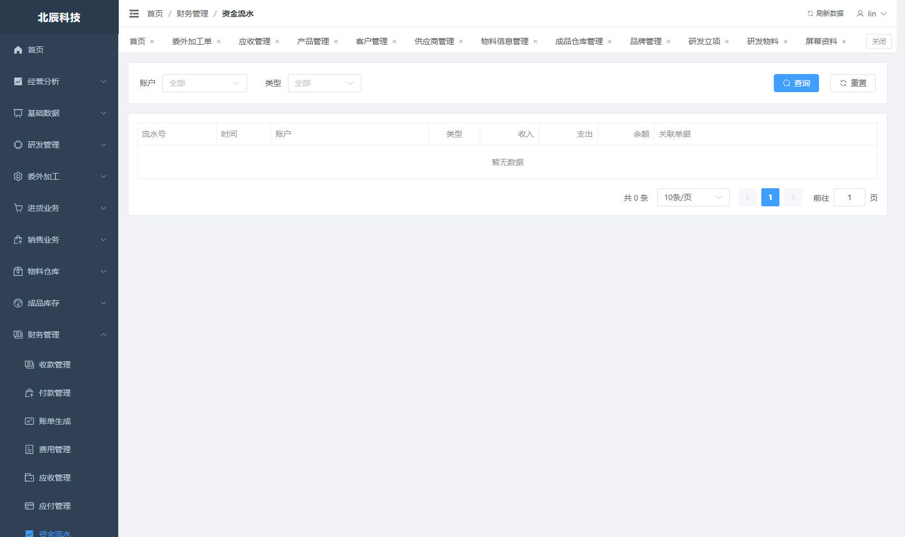

- 列：流水号（`FL-`）、时间、账户、类型、收入、支出、**余额**、关联单据；
- 筛选：账户（**故意包含已停用账户**，便于查历史）、类型（期初/收款/付款/收款冲正/付款冲正/费用支出/费用冲正）；
- **余额列** = 该账户截至这一笔的累计余额（可与账户管理页对账）；
- 反审核**不会删除**原流水，而是**追加一条冲正流水**（审计轨迹完整）。

## 8.10 发票管理

**路径**：财务管理 → 发票管理　**用途**：**税务口径的发票登记簿**（销项 / 进项），用于掌握销项税额、进项税额与应纳增值税。

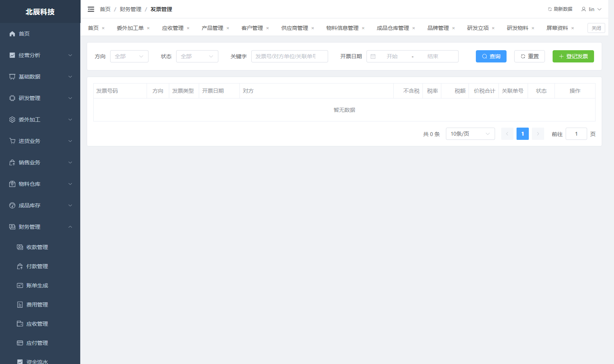

| 字段 | 必填 | 说明 |
|---|---|---|
| **方向** | **是** | 销项（我方开出）/ 进项（我方收到）；**编辑时不可改** |
| **发票号码** | **是** | 未作废范围内同公司唯一（作废后可重新登记同号） |
| 发票类型 | — | 增值税专用发票 / 普通发票 / 电子专票 / 电子普票 |
| 开票日期 | — | 默认当天 |
| 购买方/销售方 | — | 标签随方向变 |
| **金额模式** | — | 填**价税合计**（自动拆税）或填**不含税**（自动算税额） |
| 税率 | — | 默认 13% |
| 关联单号 | — | **可选**，纯文本（如填销售单号），不校验 |
| 备注 | — | — |

**关键点**：发票管理**与应收应付不联动**——它只是一个独立的税务台账（`sourceBillCode` 不参与核销、不写资金流水、不改账户）。

**状态**：已登记 →（作废）已作废；**没有审核流程，登记即生效**。

## 8.11 应付转应收

**路径**：财务管理 → 应付转应收　**用途**：把**负数应付**（退货、超损扣款等冲减项）转为**向供应商收款的应收**——适用于"当月没有货款要抵扣，需要对方把钱退给我们"的场景。

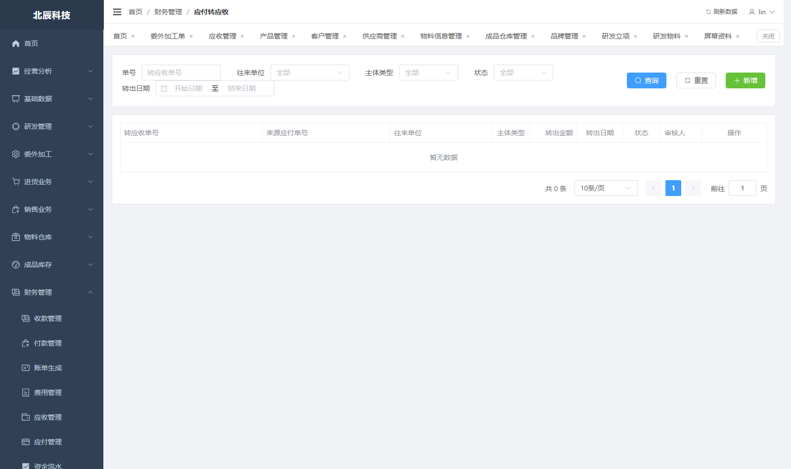

### 8.11.1 典型场景

| 场景 | 说明 |
|---|---|
| 委外超损 | 工厂超损耗赔偿，从我方应付里扣；若当月没有货款可抵 → 转成应收，向工厂收款 |
| 采购退货 | 退货后供应商欠我方钱，无货款可抵时转为应收 |
| 委外退料 / 物料退货退款 | 同理 |

> 也有**不经过转应收单**就直接生成应收的（例如"加工返回"的赔料应收，是业务单据直接生成的）。

### 8.11.2 操作

| 字段 | 说明 |
|---|---|
| **供应商** | **必须先选**（候选按该供应商收口） |
| **来源应付记录** | 下拉只列**可转的**（负数、未结清、未转出），选项显示"单号｜供应商名｜可转金额" |
| 转出日期 | 默认当天；**同时作为生成应收的到期日** |
| 转出金额 | **只读** = 来源应付金额的绝对值（当前只支持整笔转出） |

### 8.11.3 审核后

1. 生成一条**对供应商的应收**（单号 = 转应收单号，便于按单号冲销）；
2. 来源应付标记"**已转应收**"——**付款抵扣时会跳过它**（避免同一笔钱既抵扣又向对方收款）。

**反审核**：应收台账作废（**已有收款记录会被拦**）+ 来源应付恢复"可付款抵扣"资格。

### 8.11.4 校验

- "仅负数应付（退货/扣款冲减项）可转应收"；
- "该笔应付已核销或已作废，不可转应收"；
- "该笔应付已转应收，不可重复转出"。

---

# 第 9 章 经营分析

> 分析类页面**只看数、不下单**。看数前一定要先理解"口径"——同一张报表，口径不同结论可能完全相反。

## 9.1 通用口径（先读，各页不再重复）

### 9.1.1 统计区间

所有分析页顶部都有「统计区间」：**昨日 / 今日 / 本周 / 本月 / 本季 / 本年 / 自定义**。

- **归期口径**：全部按**建单日期**归期（不是单据上填的业务日期）；
- **趋势粒度**：区间 ≤62 天按天，否则按月；区间不足 7 天时后端按 7 天返回（会提示"已按 7 天显示"）。

### 9.1.2 五个核心 KPI 的公式（卡片上的问号可看到原文）

| KPI | 公式 |
|---|---|
| **销售金额** | 已审核**销售单**金额 − 已审核**销售退货**金额（按建单日） |
| **采购支出** | 已审核**采购单**金额 − 已审核**采购退货**金额（采购入库属资产，**不计入损益**） |
| **费用支出** | 已审核**费用单**金额（不含销售成本，成本在净利润里已扣） |
| **净利润** | 销售金额 − **销售成本** − 费用支出 |
| **净利率** | 净利润 ÷ 销售金额 × 100%（销售金额为 0 时显示 `-`） |

其中 **销售成本 = 销售出库成本 − 退货冲回成本**（按"净销售数量 × 产品当前移动加权成本价"估算）。

> 没有「进货业务」权限的用户，采购相关卡片会显示 `-` 并提示无权限。

## 9.2 经营概览

**路径**：经营分析 → 经营概览（默认区间：本月）

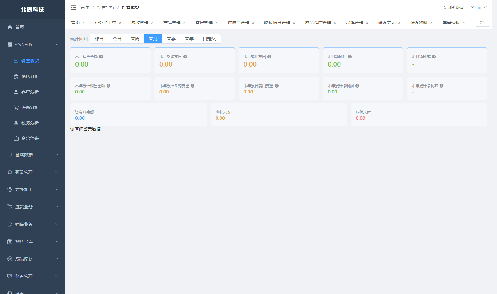

| 区块 | 内容 |
|---|---|
| ① 主指标 5 卡 | 销售金额、采购支出、费用支出、净利润、净利率（**跟随所选区间**） |
| ② 本年累计 5 卡 | 同口径，**固定 1/1 ~ 今天**（不随区间变） |
| ③ 资金与往来健康度 3 卡 | 资金总余额、应收未收（逾期时红标）、应付未付（**时点快照**，与区间无关） |
| ④ 区间趋势图 | 柱=销售金额/采购支出；线=费用支出/净利润/净利率（净利率挂右轴） |

## 9.3 销售分析

**路径**：经营分析 → 销售分析（默认：本月）

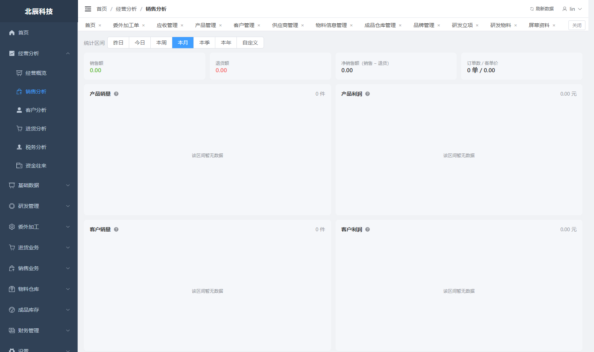

| 区块 | 内容 |
|---|---|
| ① KPI 4 卡 | 销售额、退货额、**净销售额**（销售−退货）、订单数 / 客单价 |
| ② 6 张饼图 | 产品销量、产品利润、客户销量、客户利润、**客户退货率**、**客户换货率** |
| ③ 产品销售额排行 | SKU/产品/数量/金额/占比，带合计行；点「明细」下钻到销售单明细 |
| ④ 产品销售利润排行 | 产品/利润/利润率；**亏损标红**；可下钻 |

**看数要点**：

- 每张饼图**只显示前 8 名**，其余合并为「其它」；
- 退货率/换货率各有「**金额 / 件数**」开关（两套数据一次返回，切换不重发请求）；
- 退货率 = 退货金额 ÷ 销售额；换货率 = 换货金额 ÷ 销售额；
- 利润口径：明细金额 − 数量 × 产品当前移动加权成本价。

## 9.4 客户分析

**路径**：经营分析 → 客户分析（默认：本月）

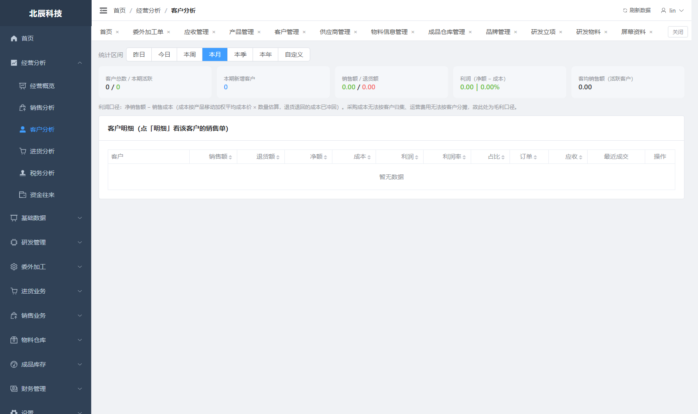

- KPI：客户总数/本期活跃、本期新增客户、销售额/退货额、利润与利润率、客均销售额；
- **客户明细表**：销售额、退货额、净额、成本、利润、利润率、占比、订单数、应收、最近成交；**表头可点击排序**；点客户名 → **单客户分析**（默认区间"本年"）；
- **单客户分析页**：客户档案 + 退货率 + 月度趋势 + 品牌分布 + 产品 TOP10 + 品质结构 + 拿货明细 + 品牌汇总 + 退货明细。

> 页面已明示：这里的利润是**毛利口径**（采购成本无法按客户归集、运营费用无法按客户分摊）。

## 9.5 进货分析

**路径**：经营分析 → 进货分析（默认：本月）

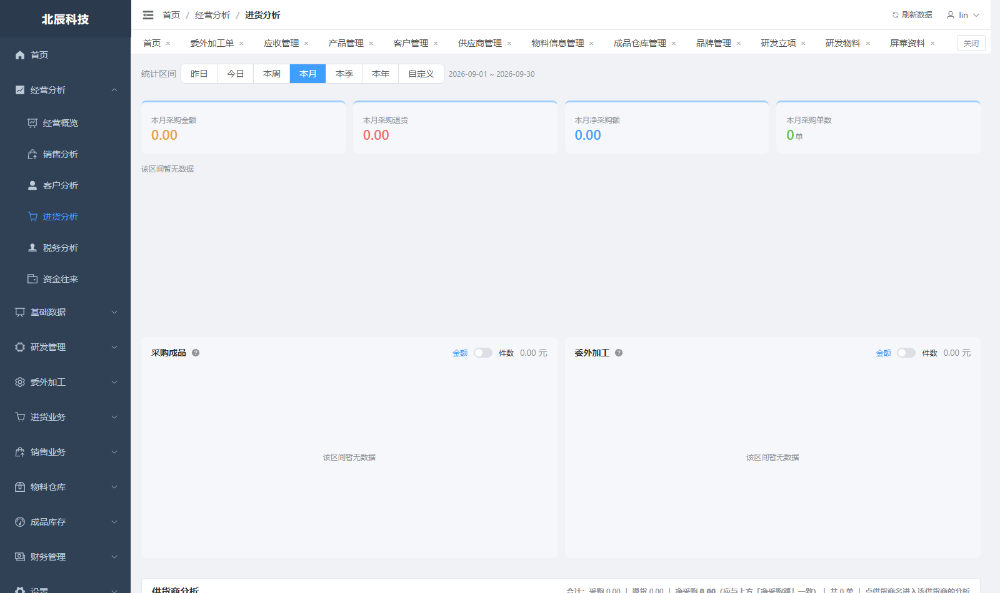

| 区块 | 内容 |
|---|---|
| ① KPI 4 卡 | 采购金额、采购退货、净采购额、采购单数（右侧显示实际生效区间） |
| ② 趋势图 | 柱=采购金额/采购退货；线=净采购额 |
| ③ 两张饼图 | **采购成品**（单产品净额 = 采购 − 采购退货）、**委外加工**（收货数量 × 加工单价，退不良自动冲减）；各带「金额/件数」开关 |
| ④ 供货商分析 | 供货商、采购金额、退货、净采购额、单数、占比（**合计应与上方"净采购额"一致**，可用于自查）；点供货商进单供货商分析 |

## 9.6 税务分析

**路径**：经营分析 → 税务分析（默认：**本年**；时间选项只有 本月/本季/本年/自定义）

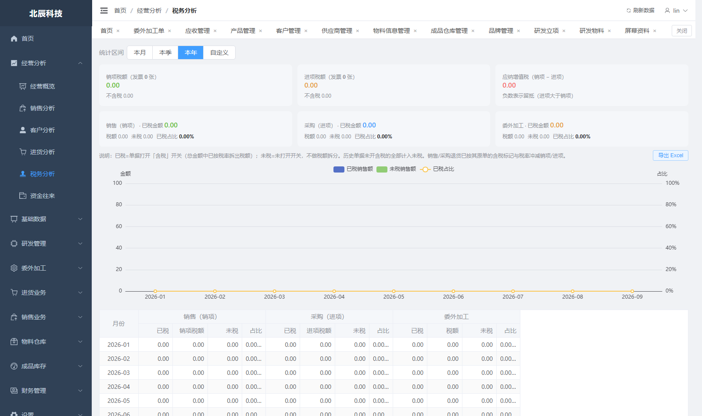

| 区块 | 内容 |
|---|---|
| ① 发票汇总 3 卡 | 销项税额、进项税额、**应纳增值税**（销项 − 进项；负数=留抵） |
| ② 区间合计 3 卡 | 销售（销项）/ 采购（进项）/ 委外加工，各显示已税金额、税额、未税、已税占比 |
| ③ 图表 | 堆叠柱（已税销售额 + 未税销售额）+ 折线（已税占比） |
| ④ 按月明细表 | 13 列（销售/采购/委外 三组的 已税·税额·未税·占比） |
| ⑤ 导出 | 「导出 Excel」（含合计行） |

**口径（页面已明示）**：

- **已税** = 单据打开了"含税"开关（总金额中已按税率拆出税额）；
- **未税** = 未打开开关，不做税额拆分；**历史单据未开含税的全部计入未税**；
- 销售/采购退货按其原单的含税标记与税率冲减。

## 9.7 资金往来

**路径**：经营分析 → 资金往来（默认：本年；**区间只作用于"资金收支趋势图"**）

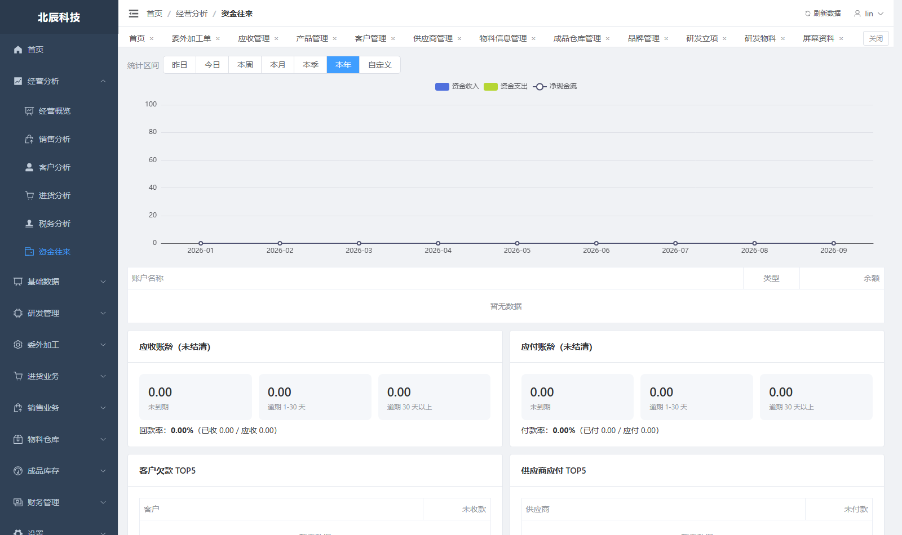

| 区块 | 是否随区间变化 |
|---|---|
| ① 资金收支趋势图（收入柱/支出柱/净现金流线） | ✅ |
| ② 账户余额表 | ❌（时点快照） |
| ③ **应收账龄**（未到期 / 逾期 1-30 天 / 逾期 30 天以上）+ 回款率 | ❌ |
| ④ **应付账龄**（同结构）+ 付款率 | ❌ |
| ⑤ TOP5：客户欠款 TOP5、供应商应付 TOP5 | ❌ |
| ⑥ 主体往来统计 | 按类型（供货商/加工厂/辅料商/方案商/其他）看**应付未付**；**供应商应收**（退货/超损已转应收、待对方付款）；**报损损失**（成品+委外物料，按报损成本） |

---

# 第 10 章 设置

> 本章是**管理员**的操作区。普通业务人员了解即可，但「数据管理」与「清空数据」相关章节建议全员知晓（避免误操作）。

## 10.1 智能管理

**路径**：设置 → 智能管理

**当前状态：功能规划中，页面为占位**（打开后只显示"智能管理"四个字）。

- 没有实际功能，也不影响其他模块；
- 若不想让用户看到这个菜单，可在「菜单管理」里把它改为"禁用"。

## 10.2 用户管理

**路径**：设置 → 用户管理　**用途**：维护本公司用户账号、角色、启停、密码与页面权限。

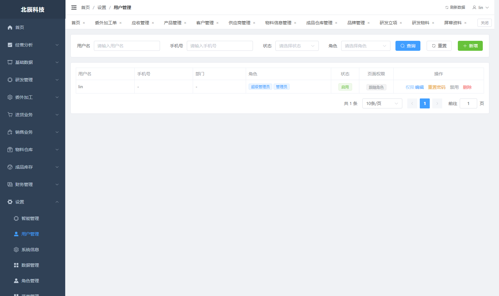

### 10.2.1 列表与筛选

- 列：用户名、手机号、部门、角色（多个标签）、状态、**页面权限**（自定义 / 跟随角色）；
- 筛选：用户名、手机号、状态、角色；
- 操作：**权限、编辑、重置密码、禁用/启用、删除**。

### 10.2.2 新增 / 编辑

| 字段 | 必填 | 说明 |
|---|---|---|
| **用户名** | **是** | **编辑时不可改**；公司内唯一 |
| **密码** | 新增时必填 | ≥3 位；编辑时不显示（改密码走"重置密码"） |
| 手机号 / 部门 | — | — |
| 状态 | **是** | 启用 / 禁用 |
| 角色 | 否 | 可多选；**下拉不含"超级管理员"**（该角色不通过这里分配） |
| **首页TAB** | 否 | 决定该用户首页显示哪些 TAB（7 个选项）；**新增时会按所选角色自动推荐默认值**；编辑时不覆盖已有配置 |

### 10.2.3 三个常用操作

| 操作 | 说明 |
|---|---|
| **重置密码** | 弹窗填新密码 → 立即生效（**没有二次确认**，请确认账号再操作） |
| **禁用 / 启用** | 禁用后该账号无法登录（历史操作记录保留） |
| **权限（页面权限）** | 见 10.2.4 |

### 10.2.4 页面权限弹窗

| 模式 | 含义 |
|---|---|
| **跟随角色**（默认） | 可见页面 = 角色的菜单授权，角色改动会**自动跟随** |
| **自定义** | 完全以该用户单独勾选的菜单为准（可加可减），**角色变化不再同步** |

规则：

- 切到"自定义"时，系统会用**该角色现有权限预填**（在既有权限上微调，不用从零勾）；
- 保存时**自动保留「首页」**并补齐上级目录；
- **不能修改自己的页面权限**（防止把自己锁在门外）；**超级管理员固定跟随角色**。

### 10.2.5 删除与特殊规则

- 删除用户是**真删除**（用户名可被重新使用；若同名用户曾被删除，新建时会**复活原记录**并重置资料）；
- **用户名 `lin`（平台超管）不可删除**；超管账号的状态只能本人修改；
- 编辑超管用户时，其"超级管理员"角色会被系统自动补回（防误降级）。

## 10.3 角色管理

**路径**：设置 → 角色管理　**用途**：维护角色与**角色的页面权限**。

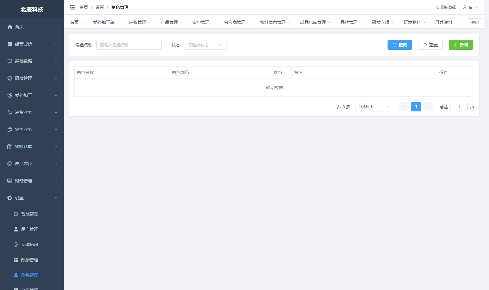

| 字段 | 必填 | 说明 |
|---|---|---|
| **角色名称** | **是** | — |
| **角色编码** | **是** | **编辑时不可改**；公司内唯一 |
| 状态 | **是** | 启用 / 禁用 |
| 备注 | — | — |

**分配权限**：点操作列「分配权限」→ 勾选菜单树（保存时自动包含父目录）→ 保存。

**删除约束**：

- 内置角色（超级管理员 `super_admin` / 管理员 `admin` / 用户 `user`）**不可删除**——其中"用户"是系统预留编码，预置角色列表里没有它；前两个还额外**不可编辑**；
- 角色下还有用户时**不可删除**（"该角色下存在 N 个用户关联，不可删除"）；
- 删除会同时清理该角色的菜单授权。

> **典型用法**：新岗位（如"售后专员"）→ 新建角色 → 分配需要的页面 → 在用户管理里把人挂上该角色。

## 10.4 菜单管理

**路径**：设置 → 菜单管理　**用途**：维护菜单树（目录/菜单）的名称、路径、图标、排序、显隐。

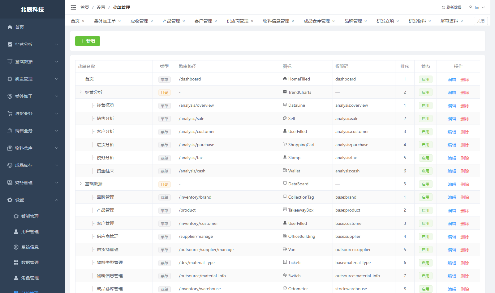

| 字段 | 必填 | 说明 |
|---|---|---|
| 父菜单 | — | 只列"目录"类型节点；编辑时会自动排除自身及子树（防环） |
| **菜单名称** | **是** | — |
| **菜单类型** | **是** | 只能选"目录 / 菜单"（**按钮类型不在这里维护**，由代码维护） |
| 路由路径 / 路由名称 | — | 如 `/dashboard` |
| 图标 | — | 图标名（需在系统图标库内） |
| **排序** | **是** | 数字越小越靠前 |
| 状态 | **是** | 启用 / 禁用 |

**要点**：

- **「权限码」列只读**（权限码由代码与后端权限守卫共同维护，界面上改不了，避免"改了码后端不认"）；
- 有子菜单时**不能删除**；
- 新增的菜单会**自动授权给管理员与超管**；
- 界面改过的菜单会标记为"自定义"：**名称/排序/显隐以你的修改为准**，但**路径/图标等结构字段仍会随代码升级同步**。

> **想隐藏某个菜单**（例如"智能管理"）：把它改成"禁用"即可，无需删除。

## 10.5 系统信息

**路径**：设置 → 系统信息（三个页签）

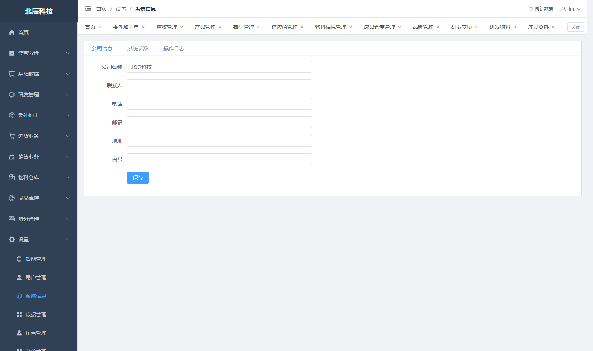

### 10.5.1 公司信息

维护本公司档案：公司名称、联系人、电话、邮箱、地址、税号（用于合同与对账单抬头）。

### 10.5.2 系统参数

| 参数键 | 默认值 | 说明 |
|---|---|---|
| `tax_rate` | 13.00 | 税率(%) |
| `credit_period` | 30 | 账期天数 |
| `stock_alert_threshold` | 10 | 库存预警阈值 |

可以直接在表格里改值后保存。**注意**：这三个参数目前仅供登记（业务逻辑多数按单据自身字段取数），修改后若发现业务行为未变，属正常。

### 10.5.3 操作日志

- 列：ID、用户、模块、操作、对象、详情、时间；
- 筛选：模块、用户、日期区间；
- 目前**只有"整库导入/导出"与"清空数据（含预演）"会写日志**，所以日志页通常很空——这是已知现状，不是故障。

## 10.6 数据管理（整库导出/导入）

**路径**：设置 → 数据管理　**权限**：**「数据导出」「数据导入」两个页签仅超级管理员可见**；「清空本公司数据」所有管理员可见。

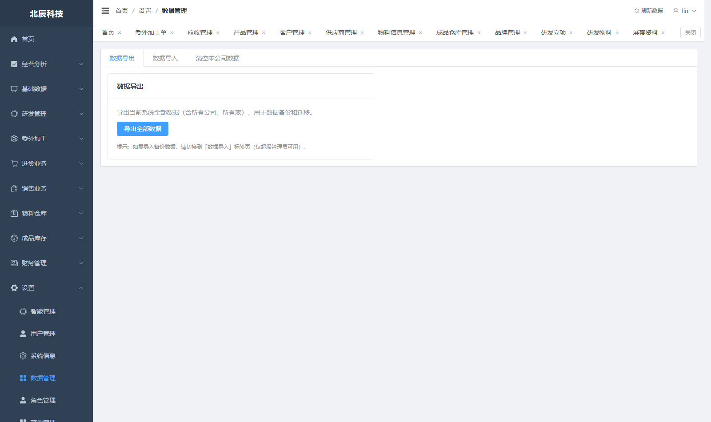

### 10.6.1 数据导出（仅超管）

| 项 | 说明 |
|---|---|
| 范围 | **整库所有表、所有公司**（含用户表，请妥善保管文件） |
| 格式 | JSON 文件，浏览器下载 `backup_日期.json` |
| 失败表 | 不静默跳过：有失败表会明确告警并列出表名 |

### 10.6.2 数据导入（仅超管）⚠️

**两步操作，且不可撤销**：

1. 选择 `.json` 文件 →「下一步」：先本地解析校验，再做**服务端只读预检**；
2. 预览页显示：备份时间、备份表数（其中 x 张有数据）、备份记录数；
   - 若**备份缺少当前库的表** → 橙色告警"导入后这些表会被清空"，**必须勾选确认**；
   - 必须**手工输入「确认导入」**才能点红色按钮。

**导入语义（务必理解）**：**用备份完全替换当前库**——先清空所有表，再按备份逐表写入。

**安全机制**：

- 落库前系统会**自动把"当前库"导出成回滚点**（路径在导入完成后会告诉你）；
- **回滚点生成失败则中止导入**（此时不会改动任何数据）；
- 若未确认"缺表"，服务端会**拒绝且不删任何数据**。

> **实操建议**：导入前先单独做一次「数据导出」自行留档；导入时确保没有其他人在操作系统。

## 10.7 清空本公司数据（危险操作）

**路径**：设置 → 清空本公司数据（也可在「数据管理」页的第三个页签操作）

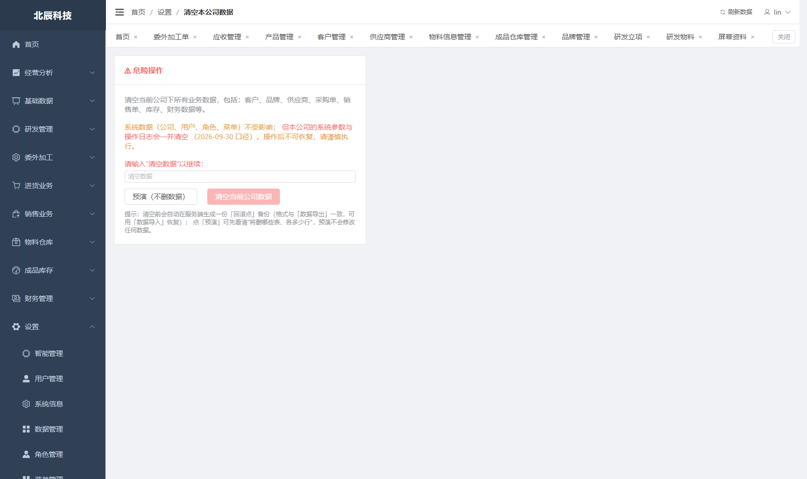

### 10.7.1 会清掉什么

**清空范围**：当前公司下的**全部业务数据**，包括——研发项目/阶段/BOM/图纸、客户、品牌、供应商、产品、委外物料与加工单、采购/销售/换货/退货整理/售后、库存与盘点、成品与物料报损、成本批次、财务（费用、发票、收付款、应收应付、应付转应收、账单、资金流水、资金账户）、备忘，**以及本公司的系统参数与操作日志**。

**不会清掉**：系统数据（公司、用户、角色、菜单）、**屏幕资料知识库**、其他公司的数据。

**清空后会自动重建**：默认物料类型、默认阶段模板（原配/改配各一套）、默认加工与采购合同模板。

### 10.7.2 三道确认（缺一不可）

1. **手工输入「清空数据」**四个字，按钮才会亮；
2. 弹窗二次确认（红色警告）；
3. **后端强制校验**：请求必须带 `confirm=清空数据`，否则拒绝（直调接口也拦）。

### 10.7.3 回滚点与预演（重要保护）

| 机制 | 说明 |
|---|---|
| **自动回滚点** | 清空前自动把本公司数据导出成 JSON（可用「数据导入」恢复）；**回滚点不完整就中止清空** |
| **预演（dryRun）** | 可先"预演"：只统计**会清空多少张表、多少行数据**并生成回滚点，**不删任何数据、无需口令**；预演也会写操作日志（留痕"谁在何时预演过"） |

> **强烈建议**：任何清空前，先做一次「预演」看清影响面，并确认回滚点已生成。

### 10.7.4 权限与上下文

- 只有**管理员/超管**能执行；
- 必须处于**某个公司上下文**中（超管未选公司时会提示"超管模式下请先选择公司"）。

---

# 第 11 章 典型业务场景走查

> 本章把前面各章串起来。**新用户建议照着走一遍**（在测试环境或空库上练），形成完整认知。

## 11.1 委外加工全流程（最核心的一条线）

**场景**：接了一个屏幕组装订单，把成品委托工厂加工，我方供料。

| 步骤 | 操作位置 | 关键动作 | 结果 |
|---|---|---|---|
| 1 | 基础数据 → 供应商管理 | 建加工厂（勾"加工厂"类型） | 系统**自动建委外仓** |
| 2 | 基础数据 → 物料信息管理 | 建物料（玻璃/驱动IC/排线…），配**子物料组成** | 供后续 BOM 与扣料 |
| 3 | 研发管理 → 研发立项 | 立项（规格=改配），填写原机/改配信息 | **自动建产品 + 套用阶段 + 写 BOM** |
| 4 | 研发立项 → 详情 → BOM信息 | 补全物料清单（含损耗率、供料方） | BOM V1 就绪 |
| 5 | 委外加工 → 物料订单 | 下物料订单（采购/委外），审核 | 生产中，可收料 |
| 6 | 委外加工 → 物料收退 | 收料（选目标仓）→ 审核 | 物料入库 + **应付** |
| 7 | 委外加工 → 加工订单 | 新增加工单（选加工厂 + 产品 + 数量），审核 | 生产中；**自动生成 BOM 快照** |
| 8 | 委外加工 → 加工收退 | 收货（拆 A/B/C/不良）→ 审核 | **委外仓扣料 + 成品入库 + 应付** |
| 9 | 委外加工 → 加工收退 | 全部收完 → 结单报表 → 结单 | **自动退料 + 超损赔款** |
| 10 | 财务管理 → 应付管理 | 查看该工厂应付，用「付款管理」付款核销 | 账清 |
| 11（如需） | 委外加工 → 加工售后 → 工厂售后 | 已结单后发现问题 → 退货 → 登记返回 | **工厂赔料应收** |
| 12（如需） | 委外加工 → 加工售后 → 客户售后 | 客户售后品送厂维修 → 登记维修返回 → 结案 | 维修费应付 |

**这条线要记住的三件事**：

1. **料在委外仓是"工厂欠我们的料"**，收货时按 BOM 扣料，结单时剩余料自动退回；
2. **加工单审核不产生任何库存/账务**，一切发生在**收货审核**；
3. **结单是分水岭**：结单后不能再做有单退货，只能走「工厂售后」。

## 11.2 采购到付款

| 步骤 | 位置 | 动作 | 结果 |
|---|---|---|---|
| 1 | 基础数据 → 供货商管理 | 建供货商，**配"供货SKU"** | 决定产品 SKU 前缀 |
| 2 | 基础数据 → 产品管理 | 建产品（自动生成 SKU） | — |
| 3 | 进货业务 → 成品采购单 | 新增（供货商 + 入库仓 + 明细）→ 审核 | **入库 + 应付**（到期 = 订单日 + 1 月） |
| 4 | 进货业务 → 采购退货单（如需） | 从采购单带入 → 审核 | **出库 + 负应付** |
| 5 | 进货业务 → 采购换货单（如需） | 退回不良 + 换入良品 → 审核 | **两条对称应付（净额=差价）** |
| 6 | 财务管理 → 应付管理 | 查看应付台账 | — |
| 7 | 财务管理 → 付款管理 | 新增付款（选供应商 → 分款账户 → 核销应付）→ 审核 | **核销 + 账户扣款 + 资金流水** |
| 8 | 财务管理 → 账单生成 | 需要盖章对账单时，按账期生成 → 审核 → 导出 Excel | 对账凭据 |

## 11.3 销售到收款

| 步骤 | 位置 | 动作 | 结果 |
|---|---|---|---|
| 1 | 基础数据 → 客户管理 | 建客户，**设账期**（月/天） | 决定应收到期日 |
| 2 | 销售业务 → 销售单 | 新增（客户 + 出库仓 + 明细 A/B/C 品质）→ 审核 | **出库 + 应收** |
| 2' | 若结算方式选**现金** | 同上，但要选收款账户 | 审核后**自动生成收款单并立即到账** |
| 3 | 财务管理 → 收款管理 | （账期单）新增收款 → 分款账户 → 核销应收 → 审核 | **核销 + 账户入账 + 资金流水** |
| 4 | 销售业务 → 销售退货单（如需） | 客户退货 → 审核 | 入"**待整理**"品质 + **负应收** |
| 5 | 成品库存 → 退货整理（如需） | 勾选待整理批次 → 生成整理草稿 → 填分选数量（+折损收款）→ 审核 | **待整理 → A/B/C/不良**；折损生成 `-LOSS` 应收 |
| 6 | 销售业务 → 销售换货单（如需） | 关联销售单 → 退回 + 换出 → 审核 | 退回入"待整理"、换出扣库存；**非 1:1 必须填收费** |
| 7 | 财务管理 → 账单生成 | 按账期出对账单 → 审核 → 导出 | 对账凭据 |

## 11.4 库存盘点闭环

| 步骤 | 位置 | 动作 |
|---|---|---|
| 1 | 成品库存 → 库存盘点 | 新建盘点单（选仓库 + 月份） |
| 2 | 盘点明细页 | 逐行填**实盘数量**（填写时注意：**盘点期间其他单据仍在动账**） |
| 3 | 盘点明细页 | 点「审核」→ 系统按差异**盘盈入库/盘亏出库** |
| 4 | 成品库存 → 库存流水 | 核对"盘点"类型的流水，确认账实一致 |
| （异常） | 盘点明细页 | 发现填错 →「反审核」→ 差异冲回，改完再审核 |

**盘点小贴士**：仓库列表页会显示"本月盘点 / 超期 N 天"；建议每月固定日期盘点并当天审核完。

## 11.5 研发立项到物料投入

| 步骤 | 位置 | 动作 |
|---|---|---|
| 1 | 基础数据 → 模版管理 | 确认**阶段模板**（原配/改配各一套）已配置 |
| 2 | 基础数据 → 物料类型/物料信息 | 建好物料与子物料（改配 IC 相关：驱动IC / 触摸IC / 码片IC / 排线） |
| 3 | 研发管理 → 研发立项 | 立项 → 自动建产品 + 套阶段 + 写改配 BOM |
| 4 | 立项详情 → BOM信息 | 补全 BOM（物料、单套用量、损耗率、供料方）→ 需要时「新建版本」 |
| 5 | 立项详情 → 项目阶段 | 按实际推进逐阶段"完成"，需要时"跳过/撤销" |
| 6 | 研发管理 → 研发物料 | 登记研发自购料；勾选「研发支出」可直接生成费用单（有权限则当场扣款） |
| 7 | 委外加工 → 加工订单 | 下加工单时**自动生成 BOM 快照**，之后改研发 BOM 不影响已下单 |

---

# 附录

## 附录 A 术语速查

| 术语 | 含义 |
|---|---|
| **位置导航** | 顶栏显示"首页 / 一级目录 / 二级目录 / 当前页面"的那行文字，点任一层可跳回；软件行业标准叫法是"面包屑导航"（Breadcrumb），本手册统一叫**位置导航** |
| **品质等级** | 成品的 A规 / B规 / C规 / 不良品 / **待整理** |
| **待整理（PENDING）** | 售后退回品的暂存档，经"退货整理"分选成 A/B/C/不良 |
| **库存形态** | 委外仓里区分"料 / 退回成品 / 维修成品"的维度，四种形态互不混算 |
| **BOM 快照** | 下加工单时固化的用料清单；多张加工单共享一份；研发改 BOM 不影响已下单 |
| **净已收** | 已收 − 已退货（用于判断还能收/退多少） |
| **可退量** | 已收 − 已退不良 − 送修中 − 订单退料 − 其他已审核退货退款 |
| **台账** | 应收/应付记录（"欠条"），由业务单据自动生成 |
| **核销** | 收款/付款单与台账的对应冲减关系，反审核据此精确冲回 |
| **预收/预付** | 多收/多付形成的负数台账（我方欠对方/对方欠我方） |
| **账单** | 把同一往来单位一个账期的多笔应收/应付合并成的对账单 |
| **移动加权成本** | 入库时按"金额 ÷ 数量"滚动计算的平均成本，成本价的来源 |
| **FIFO** | 先进先出；取料成本价时的一种兜底算法 |
| **折损** | 售后品整理时确认的价值损失，向客户收取（生成 `-LOSS` 应收） |
| **超损** | 加工结单时工厂超出的损耗，生成负向应付（工厂赔款） |

## 附录 B 单据状态 × 可执行动作（速查）

| 状态 | 常规可做 | 不可做 |
|---|---|---|
| **草稿** | 编辑、审核、作废、删除（部分单据） | 反审核 |
| **已审核** | 反审核；部分单据可结案/打印导出 | 编辑、作废（需先反审核） |
| **已作废** | 查看、复制信息 | 一切写操作 |

**通用报错对照**：

| 报错 | 含义 |
|---|---|
| 只有草稿状态可审核 | 该单已不是草稿 |
| 只有已审核状态可反审核 | 该单不是已审核（或已被反审核） |
| 仅草稿状态可作废，已审核单据请先反审核 | 先反审核再作废 |
| 只有草稿状态可编辑，已审核记录请先反审核 | 同上 |

## 附录 C 常见错误速查表

| 提示关键词 | 常见原因 | 处理 |
|---|---|---|
| 库存不足，无法出库/审核：…（可用 x，需求 y，缺口 z） | 库存确实不够 | 补货、换仓、或先入库 |
| 该…对应的应付/应收账款已核销，无法反审核 | 已收/付过款 | 先反审核收款单/付款单 |
| 该…对应库存已被后续单据消耗，无法反审核 | 货已被下游用掉 | 先处理下游单据 |
| 收款方与被核销应收的往来单位不一致 | 核销对象选错了 | 选同一往来单位的账 |
| 预收（预付）台账不能作为核销目标 | 预收/预付不能再被核销 | 走退款/冲销 |
| 该加工单已结单，账务已清算；如需退货请走「工厂售后」 | 结单后限制 | 从"工厂售后"办理 |
| 该物料订单未结单：请改用「订单退料」 | 类型与订单状态不匹配 | 改用对应类型 |
| 未找到「原配」的阶段模板 | 阶段模板未配置 | 去模版管理配置 |
| 该仓库 2026-09 已存在盘点单 | 同仓同月重复开单 | 用已有盘点单 |
| 无权限访问 | 角色权限不足 | 联系管理员分配 |
| 登录已失效，请重新登录 | 会话过期 | 重新登录 |

## 附录 D 角色 × 模块权限（默认）

| 模块 | 管理员 | 研发 | 销售 | 仓管 | 跟单 | 财务 |
|---|---|---|---|---|---|---|
| 首页 | ✅ | ✅ | ✅ | ✅ | ✅ | ✅ |
| 经营分析 | ✅ | — | — | — | — | — |
| 基础数据 | ✅ | ✅ | 部分 | 部分 | 部分 | 部分 |
| 研发管理 | ✅ | ✅ | — | — | — | — |
| 委外加工 | ✅ | — | — | 部分 | ✅ | — |
| 进货业务 | ✅ | — | — | ✅ | ✅ | — |
| 销售业务 | ✅ | — | ✅ | 部分 | ✅ | — |
| 成品库存 | ✅ | — | — | ✅ | ✅ | — |
| 物料仓库 | ✅ | — | — | ✅ | ✅ | — |
| 财务管理 | ✅ | — | — | — | — | ✅ |
| 设置 | ✅ | — | — | — | — | — |

> 实际以「角色管理」中的配置为准（可由管理员随时调整）。

## 附录 E 使用小贴士

1. **筛选框按回车 = 查询**，比点按钮快；
2. **鼠标中键点页签 = 关闭页签**；
3. 单号、客户、供应商、产品、仓库等**蓝色文字都能点**，是快速跳转的入口；
4. 表格列宽不够时**鼠标悬停看完整内容**，不用拉宽；
5. **库存流水是排查问题的第一现场**：任何"账对不上"的问题，先去流水里按单据号、变动类型查；
6. 反审核前先想一下：**这笔账收款/付款了吗？这批货被下游用掉了吗？** 想清楚再点；
7. 不确定的操作先在**测试公司**里练（超管可新建一个公司，配好账号即可随便折腾）；
8. 遇到"系统异常"提示，**把原文截图**给管理员或开发，能大幅加快定位。

---

**文档结束**

> 本手册基于系统当前实现编写（2026-09-30，代码版本 `0d051ad`）。系统功能持续迭代，若发现文中描述与系统实际不符，以**系统实际行为**为准，并请反馈给管理员更新本手册。

